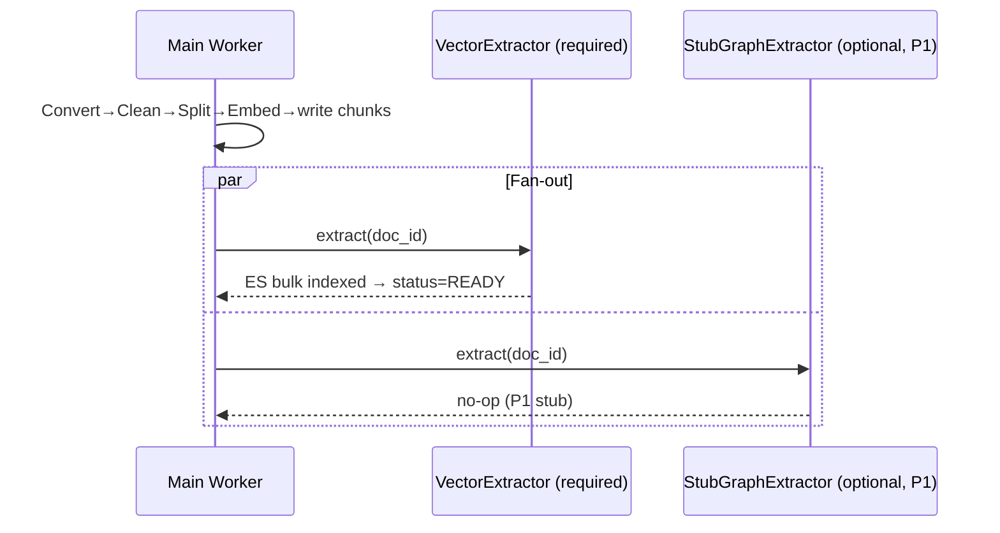
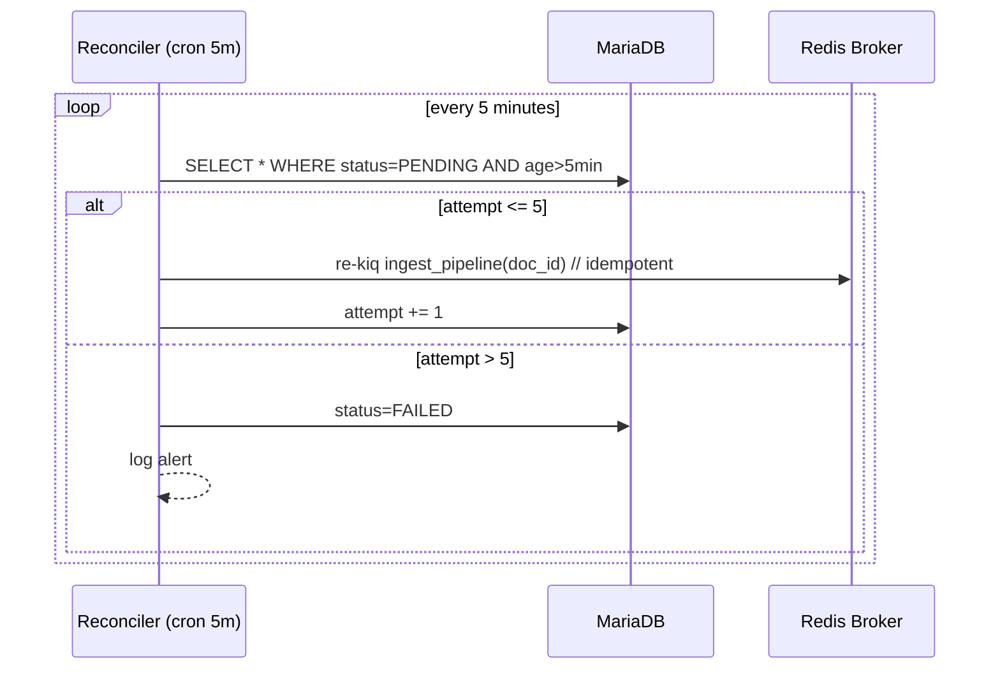
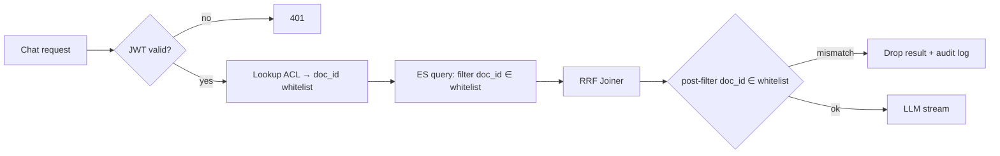

# 00_spec.md — Distributed RAG Agent System Specification (WHAT)

> Source: `docs/draft.md` · Authored: 2026-05-03 · Owner: Architect
> Standard: `docs/rule.md` §Specification Standards (WHAT, not HOW)

---

## 1. Mission & Objective

Provide an enterprise internal knowledge retrieval backend that ingests private documents (with ACL), serves grounded answers via a streaming chat API, and exposes the same retrieval capability through an MCP tool. The system delivers **resilient, recoverable, permission-aware** RAG over hybrid (vector + BM25) retrieval, extensible to graph reasoning without architectural rewrite.

**Non-Goals (System-wide):**
- No local model hosting (all inference via third-party APIs).
- No frontend (REST / SSE / MCP only).
- No public/anonymous access (JWT + ACL mandatory).

---

## 2. Domain Boundary

| Domain Topic | Responsibilities | Out-of-Scope |
|---|---|---|
| **Ingest** | Receive uploads, persist originals (MinIO), record ACL & status (MariaDB), dispatch async pipeline. | Document authoring, OCR tuning, model fine-tuning. |
| **Indexing Pipeline** | Convert → Clean → Language-route → Split → Embed → write chunks (MariaDB) → fan-out to extractor plugins. | Re-ranking, query understanding. |
| **Extractor Plugins** | Plugin Protocol v1 contract: `VectorExtractor` (required, ES bulk) + `StubGraphExtractor` (optional, no-op in P1). | Real graph extraction (P3). |
| **Retrieval & Chat** | JWT verify → ACL pre-filter → parallel ES vector + BM25 → RRF join → ACL post-filter → LLM stream (SSE). | Intent routing (P2), Rerank (P2), graph retrieval (P3). |
| **Resilience** | Redis broker + rate-limiter (separated instances), Reconciler (idempotent re-dispatch of stuck tasks). | Multi-region replication, DR drills. |
| **Auth & Permission** | JWT validation, ACL lookup, dual-layer filtering (query-time ES filter + response-time recheck). | User management UI, SSO provisioning. |
| **Observability** | Haystack auto-trace + FastAPI OTEL middleware → Tempo + Prometheus. | Custom dashboards (Phase 2). |

---

## 3. Business Process (High-level Flowcharts)

### 3.1 Ingest (async)

```
[Client] --POST /ingest (JWT, file)--> [API]
   [API] -> store MinIO -> insert documents(status=UPLOADED, acl) -> kiq ingest_pipeline
   [API] -> 202 { task_id }                                                    │
                                                                               ▼
                                                       [Worker] Haystack Ingest
                                                          ├─ happy → status=READY
                                                          └─ error → status=PENDING (Reconciler retries)
                                                                       └─ attempt>5 → FAILED + alert
```

### 3.2 Chat (sync, SSE)

```
[Client] --POST /chat (JWT, query)--> [API]
   [API] -> JWT verify -> ACL whitelist
        -> ES filter(doc_id ∈ whitelist) -> {Vector ∥ BM25} -> RRF Joiner
        -> post-filter(doc_id ∈ whitelist) -> LLM stream
        -> SSE: delta* + done{answer, sources[]}
```

---

## 4. Business Scenario (Mermaid)

### 4.1 Plugin Fan-out (Ingest)



### 4.2 Reconciler



### 4.3 Permission Dual-Layer



---

## 5. Scenario Testing (Given-When-Then) — Phase 1

### Domain: Ingest

- **S1 happy path**
  - **Given** a JWT-authenticated user with write ACL,
  - **When** they POST a 1 MB PDF to `/ingest`,
  - **Then** the API returns 202 with `task_id`, MinIO contains the original, MariaDB has `documents.status=UPLOADED`, and within 60s `status` transitions to `READY` with chunks visible in Elasticsearch.

- **S2 reconciler recovery**
  - **Given** a worker crashes after writing chunks but before VectorExtractor completes,
  - **When** 5 minutes elapse,
  - **Then** Reconciler re-dispatches the same `doc_id` and the task completes idempotently (no duplicate ES docs).

- **S3 failed after retries**
  - **Given** VectorExtractor fails 5 times due to permanent bad input,
  - **When** the 6th attempt would fire,
  - **Then** `documents.status=FAILED`, an alert log line is emitted, and the task is no longer re-dispatched.

### Domain: Plugin Protocol

- **S4 protocol contract**
  - **Given** a class declaring it conforms to `ExtractorPlugin`,
  - **When** the system inspects it at startup,
  - **Then** it must expose `name`, `required`, `queue`, `extract`, `delete`, `health` with the documented signatures, otherwise startup fails fast.

- **S5 stub graph no-op**
  - **Given** `StubGraphExtractor` is registered,
  - **When** an ingest fan-out fires,
  - **Then** `extract(doc_id)` returns without side effects, `health()` returns True, and the overall ingest still reaches `READY`.

### Domain: Chat / Retrieval

- **S6 hybrid retrieval**
  - **Given** an indexed corpus with both vector and BM25 representations,
  - **When** a JWT user POSTs a query to `/chat`,
  - **Then** the response is SSE with ≥1 `delta` event followed by exactly one `done` event whose `sources` are a subset of the user's ACL whitelist.

- **S7 permission isolation**
  - **Given** users A and B with disjoint ACLs,
  - **When** A queries content only B can read,
  - **Then** zero such documents appear in `sources` (verified at both ES filter and post-filter layers).

### Domain: API Contract

- **S8 MCP schema-only**
  - **Given** Phase 1 scope,
  - **When** a client calls `POST /mcp/tools/rag`,
  - **Then** the OpenAPI schema is published but the handler returns `501 Not Implemented` (handler arrives in Phase 2).

---

## 6. System Interface (Optional)

### 6.1 REST / SSE

| Method | Path | Auth | Request | Response |
|---|---|---|---|---|
| POST | `/ingest` | JWT | `multipart/form-data: file, acl_user_ids[]` | 202 `{ "task_id": "..." }` |
| GET  | `/ingest/{task_id}` | JWT | — | 200 `{ "status": "UPLOADED\|PENDING\|READY\|FAILED", "attempt": int }` |
| POST | `/chat` | JWT | `{ "query": str }` | `text/event-stream` (`delta`*, `done`) |
| POST | `/mcp/tools/rag` | JWT | `{ "query": str }` | **501 Not Implemented** (P1); P2 → `{ answer, sources[] }` |

**SSE event payloads** (verbatim from `draft.md`):

```jsonc
{ "event": "delta", "data": { "text": "..." } }
{ "event": "done",  "data": { "answer": "...", "sources": [{ "id", "title", "url" }] } }
```

### 6.2 Plugin Protocol v1 (frozen)

```python
class ExtractorPlugin(Protocol):
    name: str          # unique identifier, e.g. "vector"
    required: bool     # if True, ingest cannot reach READY without it
    queue: str         # TaskIQ queue name, e.g. "extract.vector"
    def extract(self, doc_id: str) -> None: ...
    def delete(self, doc_id: str) -> None: ...
    def health(self) -> bool: ...
```

---

## 7. Data Structure (Optional)

### 7.1 MariaDB

```sql
CREATE TABLE documents (
  doc_id        VARCHAR(64)  PRIMARY KEY,
  owner_user_id VARCHAR(64)  NOT NULL,
  acl_user_ids  JSON         NOT NULL,         -- ["uid1","uid2"]
  storage_uri   VARCHAR(512) NOT NULL,         -- minio://...
  status        ENUM('UPLOADED','PENDING','READY','FAILED') NOT NULL,
  attempt       INT          NOT NULL DEFAULT 0,
  created_at    DATETIME     NOT NULL DEFAULT CURRENT_TIMESTAMP,
  updated_at    DATETIME     NOT NULL DEFAULT CURRENT_TIMESTAMP ON UPDATE CURRENT_TIMESTAMP,
  INDEX idx_status_updated (status, updated_at)
);

CREATE TABLE chunks (
  chunk_id   VARCHAR(64)  PRIMARY KEY,
  doc_id     VARCHAR(64)  NOT NULL,
  ord        INT          NOT NULL,
  text       MEDIUMTEXT   NOT NULL,
  lang       VARCHAR(8)   NOT NULL,           -- "zh" / "en"
  FOREIGN KEY (doc_id) REFERENCES documents(doc_id) ON DELETE CASCADE,
  INDEX idx_doc (doc_id)
);
```

### 7.2 Elasticsearch index `chunks_v1`

```jsonc
{
  "settings": { "index": { "number_of_shards": 1, "number_of_replicas": 1 } },
  "mappings": {
    "properties": {
      "chunk_id":     { "type": "keyword" },
      "doc_id":       { "type": "keyword" },
      "acl_user_ids": { "type": "keyword" },                 // pre-filter target
      "lang":         { "type": "keyword" },
      "text":         { "type": "text", "analyzer": "standard" },
      "embedding":    { "type": "dense_vector", "dims": 1024, "index": true, "similarity": "cosine" },
      "graph_indexed":{ "type": "boolean" }                  // reserved for P3
    }
  }
}
```
