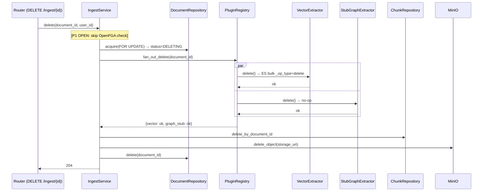
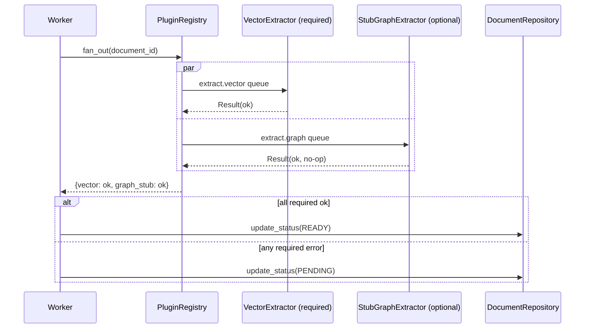
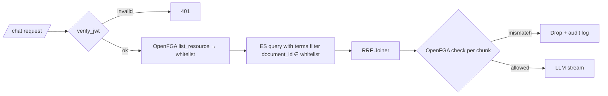
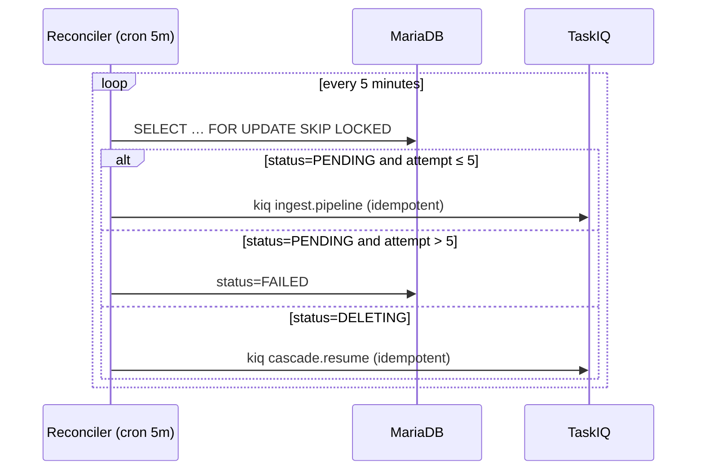

# 00_spec.md — Distributed RAG Agent System Specification (WHAT)

> Source: `docs/draft.md` · Authored: 2026-05-03 · Reorg & auth-off: 2026-05-04 (Round 3)
> Standard: `docs/00_rule.md` §Specification Standards (WHAT, not HOW)
> Reorg driver: `docs/team/2026_05_04_phase1_round3_reorg_auth_off.md` (12/12 6-of-6)

---

## 1. Mission & Scope

### 1.1 Mission
- Enterprise internal knowledge retrieval backend.
- Streaming chat answers grounded in private documents.
- Pluggable extractor architecture: graph reasoning (P3) without main-pipeline rewrite.

### 1.2 System-wide Non-Goals
- No local model hosting (all inference via third-party APIs).
- No frontend (REST / SSE / MCP only).
- No public traffic in any phase.

### 1.3 ⚠️ P1 Runs in OPEN Mode
- **Auth and OpenFGA are DISABLED in Phase 1.**
- `user_id` is read from the `X-User-Id` header for diagnostic logging only.
- Pre-filter and post-filter on chat are **no-ops** in P1.
- Startup guard refuses to launch unless `RAGENT_AUTH_DISABLED=true AND RAGENT_ENV=dev`.
- P2 is the gate before any non-dev deployment. See §3.5.

---

## 2. Phase 1 In / Out

| In Phase 1 | Deferred |
|---|---|
| Ingest CRUD (Create / Read / List / Delete) with cascade | Auth (JWT) and OpenFGA wiring → **P2** |
| Indexing Pipeline (Convert→Clean→Lang→Split→Embed) | Rerank wiring (client built P1) → **P2** |
| Plugin Protocol v1, PluginRegistry, VectorExtractor, StubGraphExtractor | ConditionalRouter intent split → **P2** |
| Chat Pipeline (ESVector ∥ ESBM25 → RRF → LLM stream) | MCP real handler → **P2** (schema published P1) |
| Resilience: Reconciler + locking | AsyncPipeline → **P2** |
| Third-party clients: Embedding, LLM, Rerank (unit), TokenManager | HR API → **P2** |
| Observability: Haystack auto-trace + FastAPI middleware | LightRAG / Real GraphExtractor → **P3** |

---

## 3. Domains

### 3.1 Domain — Ingest Lifecycle

#### Summary
- HTTP CRUD on `/ingest` resource.
- State machine: `UPLOADED → PENDING → READY \| FAILED`; with `DELETING` transient on cascade delete.
- Pessimistic locking on every status mutation.

#### Process

```
[Client] --POST   /ingest                  --> Router → IngestService.create
                                                ├─ MinIOClient.put_object(file)
                                                ├─ DocumentRepository.create(status=UPLOADED)
                                                └─ TaskIQ.kiq("ingest.pipeline", document_id)
                                              → 202 { "task_id": document_id }

[Worker @ ingest.pipeline]
   ├─ DocumentRepository.acquire(document_id)  # SELECT … FOR UPDATE
   │     status=PENDING, attempt+=1
   ├─ Indexing Pipeline (§3.2)
   ├─ ChunkRepository.bulk_insert
   ├─ PluginRegistry.fan_out(document_id)
   ├─ all required ok → status=READY
   ├─ any required error → status=PENDING (Reconciler retries §3.6)
   └─ attempt > 5 → status=FAILED + structured-log alert

[Client] --GET    /ingest/{document_id}    --> DocumentRepository.get → 200 status JSON
[Client] --GET    /ingest?after=&limit=    --> [P1 OPEN: no ACL pre-filter] → DocumentRepository.list → 200 {items, next_cursor}
[Client] --DELETE /ingest/{document_id}    --> IngestService.delete (cascade)
                                                ├─ [P1 OPEN: no FGA check]
                                                ├─ acquire(FOR UPDATE) → status=DELETING
                                                ├─ PluginRegistry.fan_out_delete (§3.3)
                                                ├─ ChunkRepository.delete_by_document_id
                                                ├─ MinIOClient.delete_object
                                                └─ DocumentRepository.delete  → 204
                                            (any failure mid-cascade → row stays DELETING; Reconciler resumes)
```

#### Cascade Delete (Mermaid)



#### BDD Scenarios

- **S1 happy path** — Given a JWT-headered user, When they POST a 1 MB PDF to `/ingest`, Then 202 + 26-char `task_id`, MinIO has the original, `documents.status=UPLOADED`, and within 60 s status becomes `READY` with chunks in ES.
- **S2 reconciler recovery** — Given a worker crashes after `status=PENDING`, When 5 min elapse, Then Reconciler re-kiqs `(document_id, attempt+1)` and the task completes idempotently.
- **S3 failed after retries** — Given a required plugin fails 5 times, When the 6th attempt would fire, Then `status=FAILED` and structured-log `event=ingest.failed document_id=… attempt=6` emitted.
- **S10 state-machine** — Allowed: `UPLOADED→PENDING, PENDING→READY, PENDING→FAILED, PENDING→DELETING, READY→DELETING, FAILED→DELETING`. Rejected (raise `IllegalStateTransition`): `UPLOADED→FAILED, READY→PENDING, FAILED→READY, DELETING→READY`.
- **S12 delete cascade happy path** — Given a `READY` document, When `DELETE /ingest/{id}` runs, Then status flips to `DELETING`, every plugin's `delete()` invoked exactly once, ES has no chunks for that `document_id`, MinIO has no object, row removed; response 204.
- **S13 delete partial failure → reconciler** — Given `MinIOClient.delete_object` raises, When request returns 500, Then row stays `DELETING`; Reconciler resumes within 5 min idempotently.
- **S14 delete idempotent** — Given a deleted document, When `DELETE` is called again, Then 204 with no plugin/ES/MinIO operation.
- **S15 list pagination** *(P1 OPEN: no ACL pre-filter)* — Given 5 stored documents, When `GET /ingest?limit=2` is called, Then response items length ≤ 2 and `next_cursor` correctly continues.

#### Endpoints
- See §4.1 (single source of truth).

---

### 3.2 Domain — Indexing Pipeline

#### Summary
- Haystack 2.x synchronous pipeline (sync in P1; AsyncPipeline P2).
- Components: `FileTypeRouter` → format converter (§4.2) → `DocumentCleaner` → `LanguageRouter` → CN/EN splitter → Embedder (3rd-party API) → `ChunkRepository.bulk_insert` → `PluginRegistry.fan_out(document_id)`.
- Pluggable points listed in §4.3.

#### Process
- Worker dequeues `ingest.pipeline` from Redis broker.
- Acquires document row with pessimistic lock.
- Runs the pipeline; chunks land in MariaDB.
- Fans out to extractor plugins per §3.3.

#### BDD
- (See §3.1 happy path S1; pipeline correctness verified in `tests/integration/test_ingest_pipeline.py`.)

---

### 3.3 Domain — Pluggable Extractors

#### Summary
- `ExtractorPlugin` Protocol v1 (frozen).
- `PluginRegistry`: explicit registration; per-plugin TaskIQ queue.
- P1 plugins: `VectorExtractor` (required), `StubGraphExtractor` (optional, no-op).

#### Plugin Protocol v1 (frozen)

```python
@runtime_checkable
class ExtractorPlugin(Protocol):
    name: str
    required: bool
    queue: str
    def extract(self, document_id: str) -> None: ...
    def delete(self, document_id: str) -> None: ...
    def health(self) -> bool: ...
```

#### PluginRegistry contract

```python
class PluginRegistry:
    def register(self, plugin: ExtractorPlugin) -> None: ...           # raises DuplicatePluginError on name conflict
    def fan_out(self, document_id: str) -> dict[str, Result]: ...      # extract path
    def fan_out_delete(self, document_id: str) -> dict[str, Result]: ...  # delete path; ALL registered plugins
    def all_required_ok(self, results: dict[str, Result]) -> bool: ...
```

#### Fan-out (Mermaid)



#### BDD
- **S4 protocol contract** — A class missing `name / required / queue / extract / delete / health` fails `isinstance(x, ExtractorPlugin)`.
- **S5 stub graph no-op** — Stub's `extract` has no side effects; ingest still reaches `READY`.
- **S11 registry invariants** — Duplicate `name` raises `DuplicatePluginError`. Required failure → `all_required_ok(results) is False`.

---

### 3.4 Domain — Retrieval & Chat

#### Summary
- Sync Haystack chat pipeline (P1).
- Hybrid retrieval: parallel ES vector + BM25 → `DocumentJoiner(reciprocal_rank_fusion)`.
- LLM streaming via `LLMClient.stream` (third-party API, §4.5).
- **P1 OPEN**: ACL pre-filter and post-filter are no-ops (passthrough).

#### Process

```
[Client] --POST /chat (X-User-Id, query)--> [Router] → ChatService.stream(user_id, query)
   user_id = request.headers["X-User-Id"]                # P1 OPEN: trace only
   pre_filter = {"terms": {"document_id": ALL}}          # P1 OPEN: no ACL pre-filter
   pipeline = QueryEmbedder → {ESVector ∥ ESBM25} → DocumentJoiner(RRF) → LLMClient.stream
   for each delta: yield SSE event "delta" {text}
   final: yield SSE event "done" {answer, sources[{id, title, url}]}
```

#### Endpoints
- See §4.1.

#### BDD
- **S6 hybrid retrieval** — Given an indexed corpus, When user POSTs to `/chat`, Then SSE emits ≥ 1 `delta` followed by exactly one `done` carrying `answer` + `sources[]`. *(P1 OPEN: `sources` is unrestricted; P2 restores ACL.)*

---

### 3.5 Domain — Auth & Permission ⚠️ DISABLED IN P1 → P2

#### P1 Behavior
- **All auth and OpenFGA layers are turned OFF in P1.**
- Endpoints accept `X-User-Id: <string>` as identity (validated as non-empty); no JWT decode.
- ACL pre-filter and post-filter are no-ops in `ChatService` and `IngestService`.
- Audit logs for destructive ops are emitted at INFO with `auth_mode=open` so P2 migration is traceable.
- **Startup guard** in `src/ragent/bootstrap.py`: refuse to start unless `RAGENT_AUTH_DISABLED=true` and `RAGENT_ENV=dev`. Otherwise `SystemExit`.

#### P2 Contract (interface published P1; implementation P2)
- JWT verification: subject claim → `user_id`.
- OpenFGA `list_resource(user_id, "can_view", "kms_page")` → pre-filter `terms(document_id ∈ whitelist)` (per-request cached).
- OpenFGA `check(user_id, "can_view", "kms_page", document_id)` per chunk → post-filter; mismatch drops + audit log.
- OpenFGA `can_delete` relation introduced in P2 to replace `can_view` for delete authorization.
- `TokenManager` (J1→J2, refresh `expiresAt − 5 min`) is **separate** from user auth — used by Embedding/LLM/Rerank clients in P1 already.

#### Mermaid (P2 target — for reference)



#### BDD (P2-gated; held for restoration)
- **S7 OpenFGA dual-filter** *(P2)* — `check` rejects post-filter even if ES leaks an out-of-scope doc.
- **S9 token refresh boundary** *(P1 — TokenManager only)* — Given J2 expiring in `4 min 59 s`, When any AI client requests a token, Then `TokenManager` re-exchanges before returning.
- **S15 list ACL pre-filter** *(P2)* — `list_resource` result restricts pagination items.

---

### 3.6 Domain — Resilience

#### Summary
- Redis broker + Redis rate-limiter (separate instances).
- Reconciler runs every 5 min; sweeps `PENDING > 5 min` and `DELETING > 5 min`.
- Idempotency key: `(document_id, attempt)`.

#### Process

```
[Reconciler @ cron 5m]
  SELECT … WHERE status IN ('PENDING','DELETING') AND age > 5m FOR UPDATE SKIP LOCKED
    PENDING:
      ├─ attempt ≤ 5 → re-kiq ingest.pipeline (idempotent)
      └─ attempt > 5 → status=FAILED + structured-log alert
    DELETING:
      └─ resume cascade delete idempotently (plugins tolerate already-deleted)
```

#### Mermaid



#### BDD
- **S2 reconciler recovery** — see §3.1.
- **S3 failed after retries** — see §3.1.
- **S13 delete resume** — see §3.1.

---

### 3.7 Domain — Observability (cross-cutting)

#### Summary
- Haystack auto-trace + FastAPI OTEL middleware → Tempo + Prometheus.
- No custom spans in P1.
- Structured logs for state-machine transitions and circuit-breaker events.
- Logs include `auth_mode=open` field in P1 (for migration auditing).

---

## 4. Inventories (single source of truth)

### 4.1 REST / SSE Endpoints

| Method | Path | Auth (P1) | Auth (P2) | Request | Response | Notes |
|---|---|---|---|---|---|---|
| POST   | `/ingest`                       | `X-User-Id` | JWT | `multipart/form-data: file` (≤ 50 MB, MIME ∈ §4.2) | `202 { "task_id": "<26-char-base32>" }` | async; pipeline kicked |
| GET    | `/ingest/{document_id}`         | `X-User-Id` | JWT + OpenFGA `check(can_view)` | — | `200 { "status", "attempt", "updated_at" }` | 404 on missing |
| GET    | `/ingest?after=&limit=`         | `X-User-Id` | JWT + OpenFGA `list_resource` pre-filter | — | `200 { "items", "next_cursor" }` | cursor pagination by `document_id` ASC; `limit ≤ 100` |
| DELETE | `/ingest/{document_id}`         | `X-User-Id` | JWT + OpenFGA `check(can_delete)` | — | `204` (idempotent) | cascade per §3.1 |
| POST   | `/chat`                          | `X-User-Id` | JWT + OpenFGA dual-filter | `{ "query": str }` | `text/event-stream` (`delta`*, `done`) | P1 OPEN: no ACL filtering |
| POST   | `/mcp/tools/rag`                 | `X-User-Id` | JWT | `{ "query": str }` | **501 Not Implemented** (P1) | schema published P1 |

### 4.2 Supported Ingest Data

| Format | MIME | Haystack Converter | Extraction Surface | Max Size | Phase |
|---|---|---|---|---|---|
| `.txt`  | `text/plain`                                                                | `TextFileToDocument`     | UTF-8 text                                  | 50 MB | **P1** |
| `.md`   | `text/markdown`                                                             | `MarkdownToDocument`     | rendered text (front-matter stripped)       | 50 MB | **P1** |
| `.pdf`  | `application/pdf`                                                           | `PyPDFToDocument`        | text-extractable pages only (no OCR P1)     | 50 MB | **P1** |
| `.docx` | `application/vnd.openxmlformats-officedocument.wordprocessingml.document`   | `DOCXToDocument`         | body paragraphs + tables (text)             | 50 MB | **P1** |
| `.pptx` | `application/vnd.openxmlformats-officedocument.presentationml.presentation` | `PPTXToDocument`         | slide text + speaker notes (images skipped) | 50 MB | **P1** |
| `.html` | `text/html`                                                                 | `HTMLToDocument`         | visible text (script/style stripped)        | 50 MB | **P1** |
| `.csv`  | `text/csv`                                                                  | `CSVToDocument`          | row-as-document                              | 50 MB | **P1** |
| `.xlsx` | `application/vnd.openxmlformats-officedocument.spreadsheetml.sheet`         | `XLSXToDocument`         | active sheets, header row                    | 50 MB | P2     |
| image-PDF | `application/pdf`                                                         | `OCRRouter` + `PyPDFToDocument` | OCR text                              | 50 MB | P2     |
| image (.png/.jpg/.tiff) | `image/*`                                                     | `TesseractOCR`           | OCR text                                     | 50 MB | P3     |

> Router contract: unsupported MIME → 415; size > 50 MB → 413. P2/P3 rows are declared but disabled in P1.

### 4.3 Pipeline Catalog

| Pipeline | Components (in order) | Pluggable Points | Timeout / Retry | Test Path | Phase |
|---|---|---|---|---|---|
| **Ingest** | `FileTypeRouter` → `*ToDocument` (per §4.2) → `DocumentCleaner` → `LanguageRouter` → `{ChineseDocumentSplitter \| NLTKDocumentSplitter}` → `Embedder (third-party API)` → `ChunkRepository.bulk_insert` → `PluginRegistry.fan_out(document_id)` | (a) per-format converter; (b) per-language splitter; (c) Embedder client; (d) registered extractor plugins | per-component default; Embedder retry 3× @ 1 s | `tests/integration/test_ingest_pipeline.py` | **P1** sync |
| **Chat**   | `QueryEmbedder` → `{ESVectorRetriever ∥ ESBM25Retriever}` → `DocumentJoiner(reciprocal_rank_fusion)` → *(P2)* `RerankSuperComponent` → *(P2)* `OpenFGA post-filter` → `LLMClient.stream` | (a) `LightRAGRetriever` (P3, 200 ms TO → []); (b) `Rerank` SuperComponent (P2 swap); (c) `ConditionalRouter` for intent split (P2); (d) replace LLM model via env | LLM 120 s timeout, retry 3× @ 2 s; OpenFGA 10 s, retry 3× @ 0.5 s | `tests/integration/test_chat_pipeline.py` | **P1** sync (AsyncPipeline P2) |

### 4.4 Plugin Catalog

| Plugin Class | `name` | `required` | `queue` | `extract()` | `delete()` | Test Path | Phase |
|---|---|:-:|---|---|---|---|---|
| `VectorExtractor`    | `vector`     | True  | `extract.vector` | embed chunks → ES bulk index by `chunk_id` | ES bulk `_op_type=delete` (idempotent) | `tests/unit/test_vector_extractor.py`  | **P1** |
| `StubGraphExtractor` | `graph_stub` | False | `extract.graph`  | no-op                                       | no-op                                  | `tests/unit/test_plugin_protocol.py`   | **P1** |
| `GraphExtractor`     | `graph`      | False | `extract.graph`  | LightRAG entity extraction → Graph DB upsert | entity GC + ref_count                  | `tests/unit/test_graph_extractor.py`   | P3     |

> Registration is explicit in `src/ragent/bootstrap.py`. `PluginRegistry.register()` raises `DuplicatePluginError` on conflicting `name`.

### 4.5 Third-Party API Catalog (per `00_rule.md` §Third-Party API)

| Client | Endpoint | Auth | Used by | Phase |
|---|---|---|---|---|
| `EmbeddingClient` | `EMBEDDING_API_URL/text_embedding` | J2 (TokenManager) | Indexing + QueryEmbedder | **P1** |
| `LLMClient`       | `LLM_API_URL/gpt_oss_120b/v1/chat/completions` | J2 (TokenManager) | Chat stream | **P1** |
| `RerankClient`    | `REREANK_API_URL/`                  | J2 (TokenManager) | Chat (wired in P2) | **P1** unit / **P2** wiring |
| `TokenManager`    | `AI_API_AUTH_URL/auth/api/accesstoken` | J1 → J2 | Embedding/LLM/Rerank | **P1** |
| `OpenFGAClient`   | `OPENFGA_API_URL/{list_resource,check}` | `gam-key` header | Auth dual-filter | **P2** (DISABLED P1) |
| `JWT verifier`    | (in-process)                        | — | User auth | **P2** (DISABLED P1) |
| `HRClient`        | `HR_API_URL/v3/employees`           | `Authorization` header | Owner resolution | **P2** |

All 3rd-party calls: timeout/retry/backoff per `00_rule.md`; circuit-breaker on the client; structured logs.

---

## 5. Data Structures

### 5.1 MariaDB (no physical FK; ORM-only relations)

```sql
CREATE TABLE documents (
  document_id    CHAR(26)    PRIMARY KEY,
  owner_user_id  VARCHAR(64) NOT NULL,
  storage_uri    VARCHAR(512) NOT NULL,
  status         ENUM('UPLOADED','PENDING','READY','FAILED','DELETING') NOT NULL,
  attempt        INT          NOT NULL DEFAULT 0,
  created_at     DATETIME(6)  NOT NULL,
  updated_at     DATETIME(6)  NOT NULL,
  INDEX idx_status_updated (status, updated_at)
);

CREATE TABLE chunks (
  chunk_id    CHAR(26)    PRIMARY KEY,
  document_id CHAR(26)    NOT NULL,
  ord         INT         NOT NULL,
  text        MEDIUMTEXT  NOT NULL,
  lang        VARCHAR(8)  NOT NULL,
  INDEX idx_document (document_id)
);
```

### 5.2 Elasticsearch index `chunks_v1`

```jsonc
{
  "settings": { "index": { "number_of_shards": 1, "number_of_replicas": 1 } },
  "mappings": {
    "properties": {
      "chunk_id":    { "type": "keyword" },
      "document_id": { "type": "keyword" },
      "lang":        { "type": "keyword" },
      "text":        { "type": "text", "analyzer": "standard" },
      "embedding":   { "type": "dense_vector", "dims": 1024, "index": true, "similarity": "cosine" }
    }
  }
}
```
> No `acl_user_ids`. P2 ACL is OpenFGA-driven (out-of-band).

### 5.3 ID + DateTime Utilities

```python
# src/ragent/utility/id_gen.py  (≤ 30 LOC)
def new_id() -> str:
    """UUIDv7 → 16 bytes → Crockford Base32 → 26 chars."""

# src/ragent/utility/datetime.py  (≤ 30 LOC)
def utcnow() -> datetime: ...        # tz=UTC always
def to_iso(dt: datetime) -> str: ... # "...Z"
def from_db(naive: datetime) -> datetime: ...  # .replace(tzinfo=UTC)
```

---

## 6. Standards Reference

- Layered: Router (HTTP only) → Service (orchestration) → Repository (CRUD only). See `00_rule.md` §Standard.
- Methods ≤ 30 LOC. Max 2-level nesting. Utilities in `utility/`.
- IDs: UUIDv7 + Crockford Base32 (26 chars).
- DateTime: end-to-end UTC, ISO 8601 with `Z` suffix.
- Database: no physical FK; mandatory index on `WHERE/JOIN/ORDER BY` fields.
- Quality gate: `uv run ruff format . && uv run ruff check . --fix && uv run pytest` before every commit.
- TDD discipline: `[STRUCTURAL]` vs `[BEHAVIORAL]` commit prefixes, never mixed.
