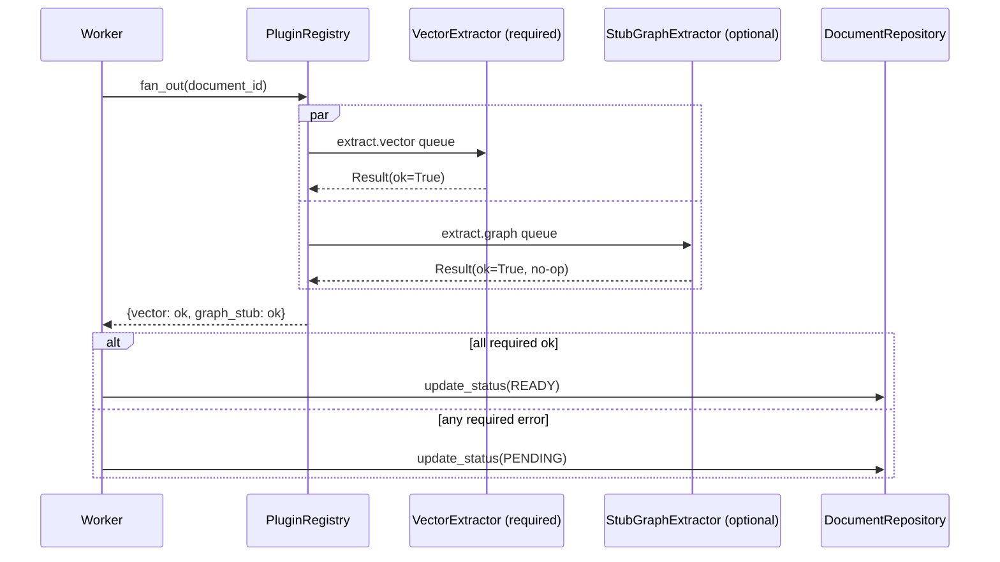
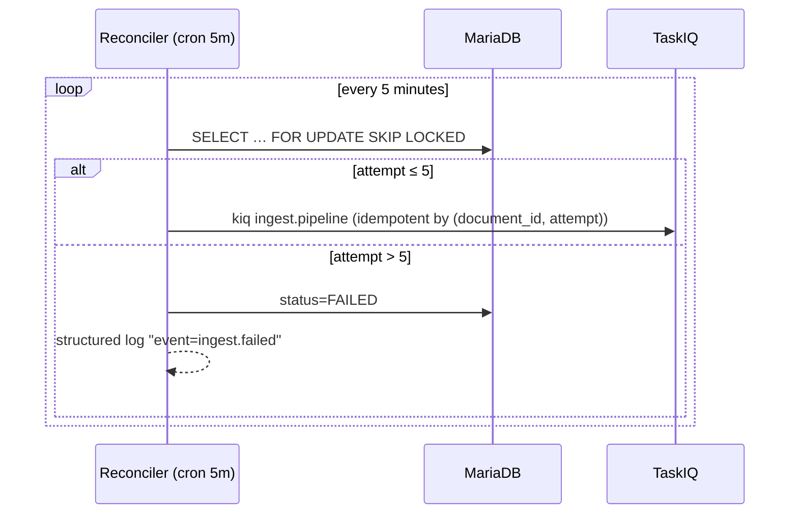
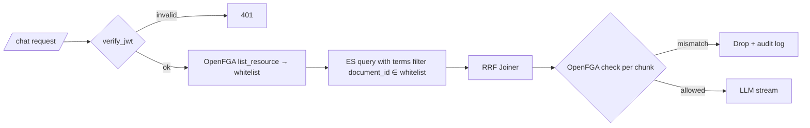
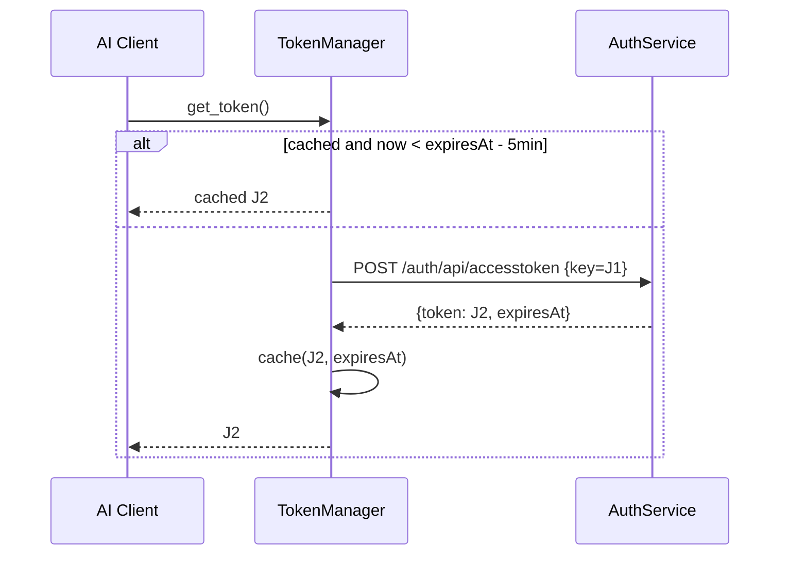
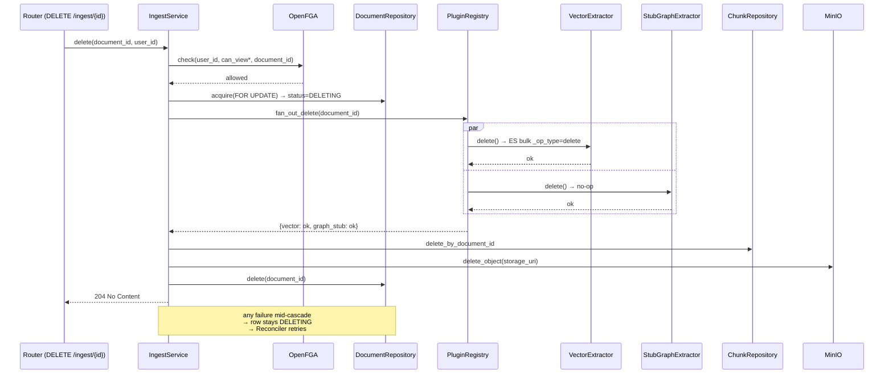

# 00_spec.md — Distributed RAG Agent System Specification (WHAT)

> Source: `docs/draft.md` · Authored: 2026-05-03 · Revised: 2026-05-04
> Standard: `docs/00_rule.md` §Specification Standards (WHAT, not HOW)
> Revision driver: team review `docs/team/2026_05_04_phase1_review.md`

---

## 1. Mission & Objective

Provide an enterprise internal knowledge retrieval backend that ingests private documents under organizational ACL (resolved through OpenFGA), serves grounded answers via a streaming chat API, and exposes the same retrieval capability through an MCP tool. The system delivers **resilient, recoverable, permission-aware** RAG over hybrid (vector + BM25) retrieval, with a **pluggable extractor architecture** that admits graph reasoning in Phase 3 without modifying the main pipeline.

**Non-Goals (System-wide):**
- No local model hosting (all inference via third-party APIs documented in `00_rule.md`).
- No frontend (REST / SSE / MCP only).
- No public/anonymous access (JWT subject + OpenFGA mandatory).

---

## 2. Domain Boundary

| Domain Topic | Responsibilities | Out-of-Scope |
|---|---|---|
| **Ingest Lifecycle** | `POST /ingest` → MinIO put → `documents` row (`UPLOADED`) → TaskIQ dispatch. State machine `UPLOADED → PENDING → READY \| FAILED`. Pessimistic lock on every status mutation. | Document authoring, OCR tuning, model fine-tuning. |
| **Indexing Pipeline** | Worker: pickup (lock, status=PENDING, attempt+=1) → Convert → Clean → LanguageRouter → CN/EN Splitter → Embedder → write `chunks` (Repository) → `PluginRegistry.fan_out(document_id)`. | Re-ranking, query understanding. |
| **Pluggable Extractors** | `ExtractorPlugin` Protocol v1 (frozen P1). `PluginRegistry` (explicit register, per-plugin TaskIQ queue). P1 plugins: `VectorExtractor` (required), `StubGraphExtractor` (optional, no-op). | Real graph extraction (P3). |
| **Retrieval & Chat** | JWT verify → OpenFGA `list_resource` → ES `terms` filter on `document_id` → parallel ES vector + BM25 → `DocumentJoiner` (RRF) → OpenFGA `check` per result → LLM stream (SSE). | Intent routing (P2), Rerank wiring (P2 — client built P1), graph retrieval (P3). |
| **Resilience** | Redis broker + Redis rate-limiter (separate instances). Reconciler (5-min cron, idempotent re-dispatch by `(document_id, attempt)`). Circuit-breaker + retry on every 3rd-party client. | Multi-region replication, DR drills. |
| **Auth & Permission** | JWT validation (subject claim = user_id). OpenFGA dual-layer: `list_resource` (pre-filter, per-request cached) + `check` (post-filter). TokenManager: J1→J2 exchange + refresh `expiresAt − 5 min`. | User management UI, SSO provisioning, HR resolution (P2). |
| **Observability** | Haystack auto-trace + FastAPI OTEL middleware → Tempo + Prometheus. Structured logs for state-machine transitions and circuit-breaker events. | Custom dashboards (Phase 2). |
| **Code Standards** | Layered: Router (HTTP only) → Service (orchestration) → Repository (CRUD only). Methods ≤ 30 LOC. ≤ 2-level nesting. Utilities in `utility/`. | Cross-layer leaks (e.g., DB calls in routers). |

---

## 3. Business Process (High-level Flowcharts)

### 3.1 Ingest (async, full lifecycle)

```
[Client] --POST /ingest (JWT, multipart)--> [Router]
   [Router] -> IngestService.create_ingest(file, user_id)
        ├─ MinIOClient.put_object(file)
        ├─ DocumentRepository.create(
        │     id=uuidv7-base32(26), owner_user_id=user_id,
        │     storage_uri="minio://...", status=UPLOADED, attempt=0)
        └─ TaskIQ.kiq("ingest.pipeline", document_id)
   [Router] -> 202 { "task_id": document_id }
                                                 │
                                                 ▼
[Worker @ ingest.pipeline]
   ├─ DocumentRepository.acquire(document_id)         # SELECT … FOR UPDATE
   │     status=PENDING, attempt+=1
   ├─ Haystack Ingest (Convert→Clean→Lang→Split→Embed)
   ├─ ChunkRepository.bulk_insert(chunks)
   ├─ PluginRegistry.fan_out(document_id)             # per-plugin queue
   ├─ all required ok → status=READY
   ├─ any required error → status=PENDING (Reconciler retries)
   └─ attempt > 5 → status=FAILED + structured-log alert

[Reconciler @ cron 5m]
   SELECT … WHERE status=PENDING AND age > 5m FOR UPDATE SKIP LOCKED
   ├─ attempt ≤ 5 → re-kiq (idempotent by (document_id, attempt))
   └─ attempt > 5 → status=FAILED + alert
```

### 3.2 Ingest CRUD (Create / Read / List / Delete)

```
[Client] --POST   /ingest                  --> create flow above (3.1)
[Client] --GET    /ingest/{document_id}    --> DocumentRepository.get → 200 {status, attempt, updated_at}
[Client] --GET    /ingest?after=&limit=    --> OpenFGA list_resource → DocumentRepository.list_by_ids → 200 {items, next_cursor}
[Client] --DELETE /ingest/{document_id}    --> IngestService.delete (cascade)
                                                ├─ OpenFGA check(can_view*)        # *P1 reuse; P2 → can_delete
                                                ├─ DocumentRepository.acquire(FOR UPDATE) → status=DELETING
                                                ├─ PluginRegistry.fan_out_delete(document_id)   ◀── all plugins, idempotent
                                                │     ├─ VectorExtractor.delete()  → ES bulk _op_type=delete
                                                │     └─ StubGraphExtractor.delete() → no-op
                                                │       (P3) GraphExtractor.delete() → entity GC
                                                ├─ ChunkRepository.delete_by_document_id
                                                ├─ MinIOClient.delete_object(storage_uri)
                                                └─ DocumentRepository.delete         → 204 No Content
                                            (any failure mid-cascade → row stays DELETING; Reconciler retries)
```

### 3.3 Chat (sync, SSE)

```
[Client] --POST /chat (JWT, query)--> [Router]
   [Router] -> verify_jwt → user_id
   [Router] -> ChatService.stream(user_id, query)
        ├─ OpenFGAClient.list_resource(user_id, "can_view", "kms_page")
        │     → cached for THIS request only
        ├─ ES query with terms filter document_id ∈ whitelist
        ├─ Haystack Chat (parallel ES vector + BM25 → RRF Joiner)
        ├─ for each candidate chunk:
        │     OpenFGAClient.check(user_id, "can_view", "kms_page", document_id)
        │     drop on mismatch + audit log
        └─ LLMClient.stream(messages) → SSE deltas + final done
```

---

## 4. Business Scenario (Mermaid)

### 4.1 Plugin Fan-out with Required/Optional contract



### 4.2 Reconciler



### 4.3 OpenFGA Dual-Layer Permission



### 4.4 TokenManager Refresh



### 4.5 Cascade Delete



---

## 5. Scenario Testing (Given-When-Then) — Phase 1

### Domain: Ingest Lifecycle

- **S1 happy path** — Given a JWT-authenticated user, When they POST a 1 MB PDF to `/ingest`, Then the response is 202 with `task_id` (26-char base32), MinIO contains the original, `documents.status=UPLOADED`, and within 60 s status transitions to `READY` with chunks in Elasticsearch.
- **S2 reconciler recovery** — Given a worker crashes after `status=PENDING` but before fan-out completes, When 5 min elapse, Then Reconciler re-kiqs `(document_id, attempt+1)` and the task completes idempotently (no duplicate ES docs).
- **S3 failed after retries** — Given a required plugin fails 5 times, When the 6th attempt would fire, Then `status=FAILED`, structured-log line `event=ingest.failed document_id=… attempt=6` is emitted.
- **S10 state-machine negative paths** (per `00_journal.md` rule) — Given any document, When transitioning UPLOADED→FAILED, READY→PENDING, or FAILED→READY, Then `update_status()` raises `IllegalStateTransition`. Allowed: UPLOADED→PENDING, PENDING→READY, PENDING→FAILED, PENDING→DELETING, READY→DELETING, FAILED→DELETING.
- **S12 delete cascade happy path** — Given a `READY` document with chunks in ES and original in MinIO, When user with `can_view` calls `DELETE /ingest/{id}`, Then status flips to `DELETING`, all plugins' `delete()` is invoked exactly once, ES has no chunks for that `document_id`, MinIO has no object, and the `documents` row is removed; response is 204.
- **S13 delete partial failure → reconciler** — Given a delete where `MinIOClient.delete_object` raises, When the request returns 500, Then the row stays `DELETING`; on the next Reconciler tick (≤ 5 min) the cascade is retried idempotently and completes.
- **S14 delete idempotent** — Given a document already deleted, When `DELETE /ingest/{id}` is called again, Then the response is 204 (not 404) and no plugin/ES/MinIO operation is performed.
- **S15 list pagination + ACL pre-filter** — Given user A with `list_resource` returning {d1, d2, d3} and stored 5 documents, When `GET /ingest?limit=2` is called, Then response items ⊆ {d1, d2, d3}, length ≤ 2, and `next_cursor` continues correctly on the second page.

### Domain: Pluggable Pipeline

- **S4 protocol contract** — Given a class declaring conformance to `ExtractorPlugin`, When inspected, Then it must expose `name / required / queue / extract / delete / health`.
- **S5 stub graph no-op** — Given `StubGraphExtractor` registered, When fan-out fires, Then `extract` returns no side effects and overall ingest still reaches READY.
- **S11 registry invariants** — Given two plugins registered with the same `name`, When the second registers, Then `register()` raises `DuplicatePluginError`. And given a plugin whose required call errors, `fan_out` returns a result map where `all_required_ok(results) is False`.

### Domain: Chat / Retrieval

- **S6 hybrid retrieval** — Given indexed corpus, When JWT user POSTs query to `/chat`, Then SSE stream emits ≥ 1 `delta` followed by exactly one `done` whose `sources` are a subset of OpenFGA `list_resource` result.
- **S7 OpenFGA dual-filter** — Given user A whose `list_resource` excludes doc_X, When ES is forced to return doc_X via direct injection, Then `check` rejects it post-filter and the chunk does not appear in `sources`; an audit log is emitted.

### Domain: Third-Party API & Auth

- **S8 MCP schema-only** — Given Phase 1 scope, When client calls `POST /mcp/tools/rag`, Then OpenAPI schema is published but handler returns `501 Not Implemented`.
- **S9 token refresh boundary** — Given a J2 token whose `expiresAt` is `now + 4 min 59 s`, When any client requests a token via `TokenManager`, Then `TokenManager` re-exchanges before returning (≥ 5 min margin enforced; uses fake clock in tests).

---

## 6. System Interface

### 6.1 REST / SSE

| Method | Path | Auth | Request | Response | Notes |
|---|---|---|---|---|---|
| POST   | `/ingest` | JWT | `multipart/form-data: file` (≤ 50 MB, MIME ∈ allow-list §6.5) | `202 { "task_id": "<26-char-base32>" }` | Async; pipeline kicked. |
| GET    | `/ingest/{document_id}` | JWT | — | `200 { "status": "UPLOADED\|PENDING\|READY\|FAILED\|DELETING", "attempt": int, "updated_at": "<ISO 8601 Z>" }` | OpenFGA `check(can_view)`; 403 on deny, 404 on missing. |
| GET    | `/ingest?after=<document_id>&limit=<≤100>` | JWT | — | `200 { "items": [...], "next_cursor": "<id>\|null" }` | OpenFGA `list_resource` pre-filter; cursor pagination by `document_id` ASC. |
| DELETE | `/ingest/{document_id}` | JWT | — | `204 No Content` (also 204 if already deleted — idempotent) | Cascade per §3.2 / §4.5; P1 reuses `can_view` (Accepted Risk, see journal 2026-05-04). |
| POST   | `/chat` | JWT | `{ "query": str }` | `text/event-stream` (`delta`*, `done`) | OpenFGA dual-filter §3.3 / §4.3. |
| POST   | `/mcp/tools/rag` | JWT | `{ "query": str }` | **501 Not Implemented** (P1); P2 → `{ answer, sources[] }` | Schema published in P1; handler in P2. |

**SSE event payloads:**

```jsonc
{ "event": "delta", "data": { "text": "..." } }
{ "event": "done",  "data": { "answer": "...", "sources": [{ "id", "title", "url" }] } }
```

### 6.2 Plugin Protocol v1 (frozen)

```python
@runtime_checkable
class ExtractorPlugin(Protocol):
    name: str
    required: bool
    queue: str
    def extract(self, document_id: str) -> None: ...
    def delete(self, document_id: str) -> None: ...
    def health(self) -> bool: ...
```

### 6.3 PluginRegistry contract

```python
class PluginRegistry:
    def register(self, plugin: ExtractorPlugin) -> None: ...           # raises DuplicatePluginError
    def fan_out(self, document_id: str) -> dict[str, Result]: ...      # extract path
    def fan_out_delete(self, document_id: str) -> dict[str, Result]: ...  # delete path; fans to ALL plugins
    def all_required_ok(self, results: dict[str, Result]) -> bool: ...
```

### 6.4 Third-Party API integration (per `00_rule.md` §Third-Party API)

| Client | Endpoint | Auth | Used by | Phase |
|---|---|---|---|---|
| `EmbeddingClient` | `EMBEDDING_API_URL/text_embedding` | J2 (TokenManager) | Indexing + QueryEmbedder | P1 |
| `LLMClient` | `LLM_API_URL/gpt_oss_120b/v1/chat/completions` | J2 (TokenManager) | Chat stream | P1 |
| `RerankClient` | `REREANK_API_URL/` | J2 (TokenManager) | Chat (wired in P2) | P1 unit / P2 wiring |
| `OpenFGAClient` | `OPENFGA_API_URL/{list_resource,check}` | `gam-key` header | Auth dual-filter | P1 |
| `TokenManager` | `AI_API_AUTH_URL/auth/api/accesstoken` | J1 → J2 | Embedding/LLM/Rerank | P1 |
| `HRClient` | `HR_API_URL/v3/employees` | `Authorization` header | Owner resolution | **P2** |

All 3rd-party calls: timeout/retry/backoff per `00_rule.md`; circuit-breaker on the client; structured logs.

### 6.5 Supported Ingest Data (single source of truth)

| Format | MIME | Haystack Converter | Extraction Surface | Max Size | Phase |
|---|---|---|---|---|---|
| `.txt`  | `text/plain`                                                                 | `TextFileToDocument`     | UTF-8 text                                  | 50 MB | **P1** |
| `.md`   | `text/markdown`                                                              | `MarkdownToDocument`     | rendered text (front-matter stripped)       | 50 MB | **P1** |
| `.pdf`  | `application/pdf`                                                            | `PyPDFToDocument`        | text-extractable pages only (no OCR P1)     | 50 MB | **P1** |
| `.docx` | `application/vnd.openxmlformats-officedocument.wordprocessingml.document`    | `DOCXToDocument`         | body paragraphs + tables (text)             | 50 MB | **P1** |
| `.pptx` | `application/vnd.openxmlformats-officedocument.presentationml.presentation`  | `PPTXToDocument`         | slide text + speaker notes (images skipped) | 50 MB | **P1** |
| `.html` | `text/html`                                                                  | `HTMLToDocument`         | visible text (script/style stripped)        | 50 MB | **P1** |
| `.csv`  | `text/csv`                                                                   | `CSVToDocument`          | row-as-document                              | 50 MB | **P1** |
| `.xlsx` | `application/vnd.openxmlformats-officedocument.spreadsheetml.sheet`          | `XLSXToDocument`         | active sheets, header row                    | 50 MB | P2     |
| image-PDF | `application/pdf`                                                          | `OCRRouter` + `PyPDFToDocument` | OCR text                              | 50 MB | P2     |
| image (.png/.jpg/.tiff) | `image/*`                                                      | `TesseractOCR`           | OCR text                                     | 50 MB | P3     |

> **Router contract**: Reject early — unsupported MIME → 415; size > 50 MB → 413. P2/P3 rows are **declared but disabled** in P1 (returning 415 with explicit "deferred" message).

### 6.6 Pipeline Catalog (single source of truth)

| Pipeline | Components (in order) | Pluggable Points | Timeout / Retry | Test Path | Phase |
|---|---|---|---|---|---|
| **Ingest** | `FileTypeRouter` → `*ToDocument` (per §6.5) → `DocumentCleaner` → `LanguageRouter` → `{ChineseDocumentSplitter \| NLTKDocumentSplitter}` → `Embedder (third-party API)` → `ChunkRepository.bulk_insert` → `PluginRegistry.fan_out(document_id)` | (a) per-format converter; (b) per-language splitter; (c) Embedder client; (d) registered extractor plugins | per-component default; Embedder retry 3× @ 1 s | `tests/integration/test_ingest_pipeline.py` | **P1** sync |
| **Chat**   | `QueryEmbedder` → `{ESVectorRetriever ∥ ESBM25Retriever}` → `DocumentJoiner(reciprocal_rank_fusion)` → *(P2)* `RerankSuperComponent` → `OpenFGA post-filter` → `LLMClient.stream` | (a) add `LightRAGRetriever` (P3, 200 ms TO → []); (b) `Rerank` SuperComponent (P2 swap); (c) `ConditionalRouter` for intent split (P2); (d) replace LLM model via env | LLM 120 s timeout, retry 3× @ 2 s; OpenFGA 10 s, retry 3× @ 0.5 s | `tests/integration/test_chat_pipeline.py` | **P1** sync (AsyncPipeline P2) |

### 6.7 Plugin Catalog (single source of truth)

| Plugin Class | `name` | `required` | `queue` | `extract()` Behavior | `delete()` Behavior | Test Path | Phase |
|---|---|:-:|---|---|---|---|---|
| `VectorExtractor`    | `vector`     | True  | `extract.vector` | embed chunks (Embedding API) → ES bulk index by `chunk_id` | ES bulk `_op_type=delete` by `chunk_id` (idempotent) | `tests/unit/test_vector_extractor.py`     | **P1** |
| `StubGraphExtractor` | `graph_stub` | False | `extract.graph`  | no-op (returns None)                                       | no-op                                                | `tests/unit/test_plugin_protocol.py`      | **P1** |
| `GraphExtractor`     | `graph`      | False | `extract.graph`  | LightRAG entity extraction → Graph DB upsert               | entity GC + ref_count decrement                      | `tests/unit/test_graph_extractor.py`      | P3     |

> **Registration**: explicit in `src/ragent/bootstrap.py`. `PluginRegistry.register()` raises `DuplicatePluginError` on conflicting `name`. Lint check (Phase 2 CI) verifies this table matches `PluginRegistry.registered_names()`.

---

## 7. Data Structure

### 7.1 MariaDB (no physical FK; ORM-only relations)

```sql
CREATE TABLE documents (
  document_id    CHAR(26)    PRIMARY KEY,
  owner_user_id  VARCHAR(64) NOT NULL,
  storage_uri    VARCHAR(512) NOT NULL,
  status         ENUM('UPLOADED','PENDING','READY','FAILED','DELETING') NOT NULL,
  attempt        INT          NOT NULL DEFAULT 0,
  created_at     DATETIME(6)  NOT NULL,
  updated_at     DATETIME(6)  NOT NULL,
  INDEX idx_status_updated (status, updated_at)
);

CREATE TABLE chunks (
  chunk_id    CHAR(26)    PRIMARY KEY,
  document_id CHAR(26)    NOT NULL,
  ord         INT         NOT NULL,
  text        MEDIUMTEXT  NOT NULL,
  lang        VARCHAR(8)  NOT NULL,
  INDEX idx_document (document_id)
);
```

### 7.2 Elasticsearch index `chunks_v1`

```jsonc
{
  "settings": { "index": { "number_of_shards": 1, "number_of_replicas": 1 } },
  "mappings": {
    "properties": {
      "chunk_id":    { "type": "keyword" },
      "document_id": { "type": "keyword" },
      "lang":        { "type": "keyword" },
      "text":        { "type": "text", "analyzer": "standard" },
      "embedding":   { "type": "dense_vector", "dims": 1024, "index": true, "similarity": "cosine" }
    }
  }
}
```

> ACL is no longer stored on chunks. OpenFGA `list_resource` supplies the pre-filter; ES filters on `document_id ∈ whitelist`.

### 7.3 ID Generation Utility

```python
# src/ragent/utility/id_gen.py  (≤ 30 LOC)
def new_id() -> str:
    """UUIDv7 → 16 bytes → Crockford Base32 → 26 chars."""
```

### 7.4 DateTime Utility

```python
# src/ragent/utility/datetime.py  (≤ 30 LOC)
def utcnow() -> datetime: ...        # tz=UTC always
def to_iso(dt: datetime) -> str: ... # "...Z"
def from_db(naive: datetime) -> datetime: ...  # .replace(tzinfo=UTC)
```
