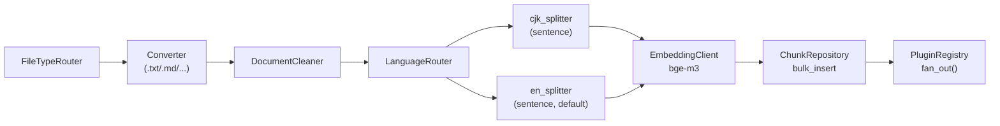

# 00_spec.md — Distributed RAG Agent

> Source: `docs/draft.md` · Standard: `docs/00_rule.md`

---

## 1. Mission

- Enterprise internal knowledge retrieval backend.
- Streaming chat answers grounded in private documents.
- Pluggable extractor architecture: graph reasoning (P3) without pipeline rewrite.

### ⚠️ P1 OPEN Mode
- Authentication **DISABLED** in P1. `X-User-Id` header trusted; recorded as `documents.create_user` (audit only, not authorization). JWT restored in a future phase.
- Permission gating **DISABLED** in P1. The Permission Layer (§3.5) ships in a future phase, backed by OpenFGA, and stays out of the retrieval/ES path.
- Startup guard refuses to start unless `RAGENT_AUTH_DISABLED=true AND RAGENT_ENV=dev`.

---

## 2. Phase 1 Scope

| In P1 | Deferred |
|---|---|
| Ingest CRUD (Create / Read / List / Delete) with cascade | JWT → P2 |
| Indexing Pipeline (§3.2) + Chat Pipeline (§3.4) | AsyncPipeline → P2 |
| Plugin Protocol v1, VectorExtractor, StubGraphExtractor | GraphExtractor → P3 |
| Third-party clients: Embedding, LLM, Rerank, TokenManager | Rerank wiring → P2 |
| Reconciler + locking | MCP real handler → P2 |
| Observability: OTEL auto-trace | — |

---

## 3. Domains

### 3.1 Ingest Lifecycle

**State machine:** `UPLOADED → PENDING → READY | FAILED`; `DELETING` transient on delete.

**Locking discipline:**
- Status mutations use **two short transactions**, not one long one:
  - **TX-A** `SELECT … FOR UPDATE NOWAIT` → write `PENDING`/terminal status → **commit** (releases row lock).
  - **Pipeline body runs OUTSIDE any DB transaction.** No row locks are held while external calls (embedder, ES, plugins, MinIO) run — this prevents pipeline hangs from blocking the Reconciler's `SKIP LOCKED` sweep.
- Worker uses `FOR UPDATE NOWAIT`: on lock contention (e.g. concurrent dispatch by Reconciler) the worker fails fast and re-kiqs itself instead of blocking on `innodb_lock_wait_timeout`.
- Reconciler uses `FOR UPDATE SKIP LOCKED`.
- `update_status` validates the state machine and raises `IllegalStateTransition` on invalid transitions.

**Storage model:** MinIO is **transient staging only** — needed because Router (API) and Worker may run on different hosts. The original file is deleted from MinIO after the pipeline reaches a terminal state (`READY` or `FAILED`). After ingest, only chunks (ES) + metadata (MariaDB) remain.

**Object key convention (B10):** `{source_app}_{source_id}_{document_id}` (single bucket `ragent-staging`). `source_app` and `source_id` are sanitized to `[A-Za-z0-9._-]` (other chars percent-encoded) to satisfy MinIO key constraints. The `document_id` suffix guarantees uniqueness even when the same `(source_app, source_id)` is re-POSTed before supersede converges.

**Pipeline retry idempotency:** Every pipeline run begins with `ChunkRepository.delete_by_document_id(document_id)` and `VectorExtractor.delete(document_id)` (idempotent ES bulk-delete) so a Reconciler retry of a partially-written attempt does not produce duplicate chunks. `chunk_id` may therefore be a fresh `new_id()` per run; identity is by `(document_id, ord)`.

**Supersede model (smart upsert):** Every `POST /ingest` carries a mandatory `(source_id, source_app, source_title)` triple (e.g. `("DOC-123", "confluence", "Q3 OKR Planning")`) and an optional `source_workspace`. The `(source_id, source_app)` pair is the **logical identity** of a document; `source_title` is human-readable display text required by chat retrieval (`sources[].title` in §3.4). At steady state at most one `READY` row may exist per `(source_id, source_app)`. A new POST always creates a fresh `document_id`; when it reaches `READY`, the system enqueues a **supersede** task that selects every `READY` row sharing the same `(source_id, source_app)`, keeps the one with `MAX(created_at)`, and cascade-deletes the rest. This guarantees "latest write wins" even when documents finish out-of-order, gives zero-downtime replacement (old chunks remain queryable until the new ones are indexed), and preserves the old version if the new ingest fails. Supersede is enqueued **only** on the `PENDING → READY` transition; FAILED or mid-flight DELETE never triggers it. Uniqueness is **eventual**, enforced by supersede — not by a DB UNIQUE constraint, since transient duplicates are expected during ingestion. **Mutation = re-POST with the same `(source_id, source_app)` (and updated `source_title` if the title changed); there is no PUT/PATCH endpoint.**

**Create flow:**
1. `POST /ingest` (`source_id`, `source_app`, `source_title`, optional `source_workspace`) → MIME/size validation → MinIO upload (staging) → `documents(UPLOADED, source_id, source_app, source_title, source_workspace)` → kiq `ingest.pipeline` → 202.
2. Worker `ingest.pipeline`:
   - **TX-A:** `acquire FOR UPDATE NOWAIT`. On lock contention → re-kiq self with backoff and exit (no attempt increment). On success → `PENDING`, `attempt+1`, **commit**.
   - **Pipeline body (no DB tx):** `delete_by_document_id` (idempotency) → run §3.2 → `fan_out` → all required ok ⇒ outcome=`READY`; any required error ⇒ outcome=`PENDING_RETRY` (no terminal commit; Reconciler resumes); attempt > 5 ⇒ outcome=`FAILED`.
   - **TX-B (terminal only):** commit `READY` or `FAILED`. **On `FAILED`, also call `fan_out_delete` + `delete_by_document_id` to clean partial output before commit.**
   - **Post-commit (best-effort, no tx):** `MinIOClient.delete_object` (errors swallowed → log `event=minio.orphan_object`); on `READY`, kiq `ingest.supersede(document_id)` (idempotent).
3. Worker `ingest.supersede`:
   - **Single-loser-per-tx:** in a loop, `SELECT 1 row` matching `(source_id, source_app, status='READY')` ordered ASC by `created_at` (i.e. the oldest non-survivor) using `FOR UPDATE SKIP LOCKED` → cascade-delete that row → commit → repeat. Survivor = whichever row remains last; query naturally stops when only one `READY` row is left for the pair. **Avoids holding K row-locks across K cascades.**
   - Naturally idempotent: re-delivery finds ≤ 1 row and no-ops.

**Delete flow:**
1. `DELETE /ingest/{id}` → `acquire FOR UPDATE NOWAIT` → `DELETING` (commit short tx) → outside-tx: `fan_out_delete` → `delete_by_document_id` → if status was `PENDING/UPLOADED` also `MinIO.delete_object` → final tx: delete row → 204.
2. Any mid-cascade failure → row stays `DELETING`; Reconciler resumes idempotently.

**BDD:**
- **S1** POST 1 MB `.txt` → 202 + 26-char task_id; status → `READY` within 60 s; chunks in ES.
- **S10** Illegal transitions (e.g. `READY→PENDING`) raise `IllegalStateTransition`.
- **S12** DELETE cascade on `READY` doc → `DELETING` → all plugins called once → ES/row cleared → 204 (MinIO already cleared at READY).
- **S13** Any failure mid-delete → row stays `DELETING`; Reconciler resumes ≤ 5 min.
- **S16** Pipeline reaches terminal state (`READY` or `FAILED`) → MinIO object deleted; subsequent re-processing not possible without re-upload.
- **S14** Re-DELETE an already-deleted document → 204, no plugin calls.
- **S15** `GET /ingest?limit=2` on 5 docs → ≤ 2 items + `next_cursor` continues.
- **S17 supersede happy path** — Given a `READY` doc D1 with `(source_id="X", source_app="confluence")`, When client POSTs another file with the same pair, Then a new doc D2 is created; while D2 is `PENDING`, queries still see D1 chunks; when D2 reaches `READY`, supersede task cascade-deletes D1; queries now see only D2 chunks.
- **S18 supersede on failure preserves old** — Given D1 `READY` with `(source_id, source_app)=("X","confluence")`, When new D2 with the same pair ends up `FAILED`, Then D1 remains `READY` and queryable; supersede task is **not** enqueued.
- **S19 supersede idempotent** — Given supersede already ran for D2, When the task fires again, Then no further deletes occur (only one `READY` row remains for that `(source_id, source_app)`).
- **S20 supersede out-of-order finish** — Given D1 (created at t=0) and D2 (created at t=1) share `(source_id="X", source_app="confluence")`, When D2 reaches `READY` first (D1 still `PENDING`) and D1 reaches `READY` later, Then after both supersede tasks run only D2 (the row with `MAX(created_at)`) remains; D1 is cascade-deleted.
- **S22 same source_id different source_app coexist** — Given doc D1 with `(source_id="X", source_app="confluence")` is `READY`, When client POSTs with `(source_id="X", source_app="slack")`, Then both reach `READY` and coexist; supersede touches neither.
- **S23 missing source_id, source_app, or source_title** — Given a POST omits any of `source_id` / `source_app` / `source_title`, Then router returns 422 problem+json with field-level `errors[]`; no MinIO upload, no DB row.
- **S21 worker crash post-commit MinIO orphan tolerated** — Given the worker has committed `status=READY` but crashed before `MinIO.delete_object` returned, When the document is fetched, Then status is `READY` and the orphan staging object is logged as `event=minio.orphan_object` (acceptable; P2 sweeper will GC).
- **S24 UPLOADED orphan recovered (R1)** — Given a row in `UPLOADED` for > 5 min (TaskIQ message lost or broker outage at POST time), When the Reconciler runs, Then it re-kiqs `ingest.pipeline` and the doc proceeds normally.
- **S25 pipeline retry produces no duplicate chunks (R4)** — Given a Reconciler retry of a previously partially-written ingest, When the pipeline reruns, Then `chunks` count for that `document_id` equals the chunker's output and `chunks_v1` ES index has no orphans.
- **S26 multi-READY invariant repaired (R3)** — Given two `READY` rows for the same `(source_id, source_app)` (e.g. supersede task lost between status commit and kiq), When the Reconciler runs, Then it re-enqueues `ingest.supersede` and convergence happens within one cycle.
- **S27 FAILED transition cleans partial output (R5)** — Given a doc transitions to `FAILED`, When the FAILED state is committed, Then `chunks` and ES `chunks_v1` for that `document_id` have been cleared (no leakage into chat retrieval).
- **S28 worker FOR UPDATE NOWAIT contention (R7)** — Given two workers receive the same `document_id` (initial kiq + Reconciler dispatch), When the second worker tries to acquire, Then it fails fast (`NOWAIT`), re-kiqs itself with backoff, and does not increment `attempt`.
- **S29 plugin call timeout (R6)** — Given a plugin's `extract()` exceeds its declared timeout, When `fan_out` waits, Then the plugin returns `Result(error="timeout")` and the worker treats it as a normal required-plugin error (PENDING + Reconciler retry).
- **S30 reconciler heartbeat (R8)** — Given the Reconciler tick runs, Then a metric `reconciler_tick_total` is incremented and a structured-log `event=reconciler.tick` line is emitted; absence > 10 min triggers Prometheus alert.
- **S31 supersede single-loser-per-tx (P-C)** — Given supersede must delete K=10 losers, When the task runs, Then each loser is deleted in its own committed transaction (loop), not one transaction holding K row-locks.
- **S32 ES freshness window (P-G)** — Given a chunk just indexed, When chat queries within 1 s, Then it may not yet be visible (acceptable per default `refresh_interval=1s`); within 60 s it is queryable (S1 acceptance).

---

### 3.2 Indexing Pipeline

```
FileTypeRouter → Converter → DocumentCleaner → LanguageRouter → {cjk_splitter | en_splitter} → EmbeddingClient → ChunkRepository → PluginRegistry.fan_out()
```



**Haystack 2.x sync Pipeline in P1; AsyncPipeline in P2.**

Pluggable points: (a) per-format converter, (b) per-language splitter, (c) EmbeddingClient, (d) registered extractor plugins.

**Performance & timeout discipline (R6, P-B):**
- The pipeline's first step is `ChunkRepository.delete_by_document_id` + `VectorExtractor.delete` (idempotency for retry — see §3.1).
- `EmbeddingClient` is invoked in **batches of 32 chunks** per HTTP call (configurable; never 1-by-1).
- Every external call carries an explicit timeout: Embedder 30 s/batch, ES bulk 60 s, MinIO get 30 s, plugin `extract()` 60 s overall (enforced by `PluginRegistry.fan_out`).
- The pipeline body runs with no DB transaction open (see §3.1 locking discipline).

---

### 3.3 Pluggable Extractors

**Protocol v1 (frozen):**

```python
@runtime_checkable
class ExtractorPlugin(Protocol):
    name: str; required: bool; queue: str
    def extract(self, document_id: str) -> None: ...
    def delete(self, document_id: str) -> None: ...
    def health(self) -> bool: ...
```

**P1 plugins:** `VectorExtractor` (required, ES bulk), `StubGraphExtractor` (optional, no-op). See §4.4.

**Registry:**
- `register()` raises `DuplicatePluginError` on name conflict.
- `fan_out(document_id)` → dispatch extract to all plugins concurrently; **per-plugin timeout 60 s** (overrun → `Result(error="timeout")`); `all_required_ok(results)` gates `READY`.
- `fan_out_delete(document_id)` → dispatch delete to all plugins concurrently; **per-plugin timeout 60 s**; runs **outside any DB transaction** (no row locks held during plugin network calls — P-E).

**BDD:** S4 (missing field → isinstance fails), S5 (stub no-op → READY), S11 (duplicate name raises).

---

### 3.4 Chat Pipeline

```
QueryEmbedder → {ESVectorRetriever ∥ ESBM25Retriever} → DocumentJoiner(RRF) → SourceHydrator(JOIN documents) → LLMClient.{chat | stream}
```

**Two endpoints (B12):**
- `POST /chat` → non-streaming, returns full JSON body once LLM completes.
- `POST /chat/stream` → SSE; `delta` events stream incremental `content`, closing with one `done` event whose data payload is the same JSON body as `/chat`.

Both share the same request schema and the same retrieval pipeline; only the LLM call differs (`LLMClient.chat` vs `LLMClient.stream`).

**P1 OPEN:** no permission gating; `sources[]` unrestricted. Future phase introduces a **Permission Layer post-filter** on retrieved chunks (§3.5) — ES queries themselves remain permission-blind in every phase.

**Performance note (P-A):** Haystack sync Pipeline in P1 runs `ESVectorRetriever` and `ESBM25Retriever` **sequentially**, so chat latency = `vector + BM25 + LLM` (additive). True parallelism requires AsyncPipeline (P2) or wrapping the two retrievers in a custom `ThreadPoolExecutor` SuperComponent. P1 ships sequential and accepts the latency hit; P2 makes them concurrent.

#### 3.4.1 Request schema (shared by `/chat` and `/chat/stream`)

```json
{
  "messages":    [{"role": "system|user|assistant", "content": "..."}],
  "provider":    "openai",
  "model":       "gptoss-120b",
  "temperature": 0.7,
  "maxTokens":   4096
}
```

- Only `messages` is required. All other fields are optional and fall back to the defaults shown above.
- `maxTokens` caps the LLM output (`completionTokens`); not the prompt.
- If `messages` does not contain a `role:"system"` entry, the server **prepends** `{"role":"system","content":"You are a helpful assistant"}` before invoking the LLM.
- The retrieval query is the **last `role:"user"` message**; preceding messages are passed through to the LLM as conversation history.
- Validation errors → 422 RFC 9457 problem+json (B5).

#### 3.4.2 Response schema

`/chat` (non-streaming, `Content-Type: application/json`) and the terminal `done` event of `/chat/stream` both carry:

```json
{
  "content":  "COMPLETE_MARKDOWN_RESPONSE",
  "usage":    {"promptTokens": 0, "completionTokens": 0, "totalTokens": 0},
  "model":    "gptoss-120b",
  "provider": "openai",
  "sources":  [
    {
      "document_id": "01J9...",
      "source_app":  "confluence",
      "source_id":   "DOC-123",
      "type":        "knowledge",
      "title":       "Q3 OKR Planning",
      "excerpt":     "...chunk text snippet..."
    }
  ]
}
```

- `sources` is `null` when no chunks were retrieved (e.g. empty index, retriever error fallback). Otherwise every entry has **all fields populated** — partial rows are not emitted.
- `sources[].type` is reserved for future categorisation; **P1 always emits `"knowledge"`**. Future values `"app"` and `"workspace"` will be derived in a later phase.
- `sources[].title` comes from `documents.source_title` (joined on `document_id` after retrieval).
- `sources[].excerpt` is the chunk text the retriever surfaced (truncated server-side to 512 chars).
- `usage` is reported by `LLMClient`; for streaming the LLM API must include final usage (e.g. OpenAI `stream_options.include_usage=true`).

#### 3.4.3 Streaming wire format (`/chat/stream` only)

```
data: {"type":"delta","content":"<token chunk>"}\n\n
…
data: {"type":"done", ...response schema as 3.4.2…}\n\n
```

**Error mid-stream (B6):** If the LLM or any retriever fails *after* the first `delta` has been written, the server emits a single default-event `data:` line with payload `{"type":"error","error_code":"<CODE>","message":"<text>"}` and closes the connection. **No `event: error` named-event is used.** Pre-stream failures (before the first `delta`) return a normal RFC 9457 problem+json response. `/chat` always uses problem+json on error (it has no streaming surface).

**BDD:**
- **S6**  — `POST /chat/stream` emits ≥ 1 `data: {type:"delta",...}` then exactly one `data: {type:"done",...}` carrying `content`, `usage`, `model`, `provider`, `sources`.
- **S6a** — `POST /chat` returns `200 application/json` with the full §3.4.2 body (single response, no streaming framing).
- **S6b** — Request without `role:"system"` entry → server prepends the default system message before LLM invocation; observable via mock LLM capture.
- **S6c** — Request with only `messages` → defaults (`provider="openai"`, `model="gptoss-120b"`, `temperature=0.7`, `maxTokens=4096`) applied.
- **S6d** — Empty retrieval (index empty or retriever error) → response `sources: null` and the LLM still answers.
- **S6e** — Every emitted `sources[]` entry has all six fields populated and `type="knowledge"`.
- **S8**  — `POST /mcp/tools/rag` returns 501 in P1 (handler not yet wired).

---

### 3.5 Authentication & Permission

Two distinct concerns, kept architecturally separate from retrieval:

| Concern | Question answered | Mechanism | P1 | Future phase |
|---|---|---|---|---|
| **Authentication** | Who is the caller? | JWT verify → `user_id` from subject claim | OFF — `X-User-Id` header trusted, validated non-empty | JWT validated via FastAPI dependency |
| **Permission** | Can this caller see this document? | Permission Layer service that calls **OpenFGA** | OPEN — no checks, all docs visible | `PermissionClient.batch_check(user_id, document_ids)` returns the allowed subset |

**Design principle:** Elasticsearch (`chunks_v1`) carries **no auth fields** in any phase. Retrieval is permission-blind; the Permission Layer post-filters retrieved chunks by their `document_id`. This keeps ES schema stable across phases, avoids the "owner-filter on every chunk" duplication, and lets the permission model evolve (roles, sharing, groups) without re-indexing.

**Permission Layer interface (future phase):**

```python
class PermissionClient(Protocol):
    def batch_check(self, user_id: str, document_ids: list[str], relation: str = "viewer") -> set[str]: ...
    def list_objects(self, user_id: str, relation: str = "viewer") -> list[str] | None: ...  # None = "too many, fall back to batch_check"
```

`PermissionClient` is the single integration point for OpenFGA. It is the only module that imports the OpenFGA SDK; everything else depends on the Protocol.

**Chat retrieval gating (future phase):**

```
ES retrieval (top K' candidates)
       ↓
PermissionClient.batch_check(user_id, candidate_doc_ids)
       ↓
filter to allowed → SourceHydrator → LLM
```

Retrieval may over-fetch (`K' = K × overfetch_factor`) so that after permission filtering at least K results remain. Strategy and `overfetch_factor` are decided when the future phase ships; not P1 concerns.

**P1 (current phase):**
- No JWT — `X-User-Id` is a trusted string, used only for `documents.create_user` (audit) and OTEL span tags.
- No Permission Layer — chat returns all matching chunks, ingest list endpoint is unrestricted.
- Audit logs for destructive ops emitted at INFO with `auth_mode=open`.
- **TokenManager (J1→J2) is active in P1** — used by Embedding/LLM/Rerank clients only (third-party API auth, unrelated to user auth).

**Note on prior decision:** An earlier round declared OpenFGA out-of-scope across all phases (see `00_journal.md`). That decision is **superseded** here: OpenFGA returns as the Permission-Layer backend in a future phase, but is fully encapsulated behind `PermissionClient` and never reaches the retrieval / data layers. The original concern (no out-of-band ACL on every ES query) is preserved by routing permission checks through a post-retrieval gate, not an ES filter.

**BDD (future-phase-gated):** S9 (token refresh at `expiresAt − 5 min`); permission-gating BDD specified when that phase plan is written.

---

### 3.6 Resilience

**Reconciler (Kubernetes `CronJob`, schedule `*/5 * * * *`, `SELECT … FOR UPDATE SKIP LOCKED`) — B9:**

> Implementation = a one-shot Python entrypoint (`python -m ragent.reconciler`) packaged in the same image, scheduled by **K8s CronJob** with `concurrencyPolicy: Forbid` and `successfulJobsHistoryLimit: 3`. Not a TaskIQ scheduled task (decouples sweeper liveness from broker health — Reconciler is the recovery surface for broker outage itself, see R1).

- `UPLOADED > 5 min` → re-kiq `ingest.pipeline` (R1 — covers TaskIQ message loss and broker outage at POST time).
- `PENDING > 5 min, attempt ≤ 5` → re-kiq `ingest.pipeline` (idempotent key: `document_id + attempt`).
- `PENDING > 5 min, attempt > 5` → `FAILED` (cleans chunks/ES per §3.1 R5 path) + structured-log `event=ingest.failed`.
- `DELETING > 5 min` → resume cascade delete idempotently.
- **Multi-READY invariant repair (R3):** every cycle also runs `SELECT source_id, source_app FROM documents WHERE status='READY' GROUP BY source_id, source_app HAVING COUNT(*) > 1` and re-enqueues `ingest.supersede` for each pair.
- **Heartbeat (R8):** every tick increments `reconciler_tick_total` and emits `event=reconciler.tick`. Prometheus alert fires if no tick observed for > 10 min (Reconciler is itself a single point of failure).

**BDD:**
- **S2** Given a `PENDING` document older than 5 min with `attempt ≤ 5`, When the reconciler runs, Then it re-kiqs `ingest.pipeline` exactly once per cycle (idempotent across redelivery).
- **S3** Given a `PENDING` document with `attempt > 5`, When the reconciler runs, Then status transitions to `FAILED`, partial output is cleaned, and a structured log line `event=ingest.failed` is emitted.
- See also S24 (UPLOADED orphan), S26 (multi-READY repair), S30 (heartbeat).

**Infrastructure:** Redis broker (TaskIQ) and Redis rate-limiter are **separate instances**.

---

### 3.7 Observability

- Haystack auto-trace + FastAPI OTEL middleware → Tempo + Prometheus.
- Structured logs for state-machine transitions; `auth_mode=open` field in P1.
- **Heartbeat metrics (R8):** `reconciler_tick_total` (counter); Prometheus alert when missing > 10 min. Worker emits `worker_pipeline_duration_seconds` (histogram) and `event=ingest.{started,failed,ready}`.
- **Orphan/leak counters:** `minio_orphan_object_total` (post-commit cleanup failure), `multi_ready_repaired_total` (Reconciler R3 sweep).

---

## 4. Inventories

### 4.1 Endpoints

| Method | Path | P1 Auth | Request | Response |
|---|---|---|---|---|
| POST   | `/ingest`               | `X-User-Id` | `multipart/form-data: file` (≤ 50 MB, MIME ∈ §4.2), `source_id` (≤ 128, **mandatory**), `source_app` (≤ 64, **mandatory**), `source_title` (≤ 256, **mandatory**), `source_workspace` (≤ 64, optional) | `202 { task_id }` — `task_id` **is** the `document_id` (26-char Crockford Base32). 422 problem+json if any of `source_id` / `source_app` / `source_title` missing/empty. |
| GET    | `/ingest/{id}`          | `X-User-Id` | — | `200 { status, attempt, updated_at }` |
| GET    | `/ingest?after=&limit=` | `X-User-Id` | — | `200 { items, next_cursor }` (limit ≤ 100) |
| DELETE | `/ingest/{id}`          | `X-User-Id` | — | `204` idempotent |
| POST   | `/chat`                 | `X-User-Id` | §3.4.1 schema (`messages` required; rest default) | `200 application/json` per §3.4.2 |
| POST   | `/chat/stream`          | `X-User-Id` | §3.4.1 schema | `text/event-stream` per §3.4.3 (`data: {type:delta\|done\|error}`) |
| POST   | `/mcp/tools/rag`        | `X-User-Id` | `{ query: str }` | **501** (P1) |
| GET    | `/livez`                | none        | — | `200 {"status":"ok"}` — process up; no dependency probes |
| GET    | `/readyz`               | none        | — | `200` if MariaDB + ES + Redis + MinIO probes all OK; else `503 application/problem+json` listing failed deps |
| GET    | `/metrics`              | none        | — | `200 text/plain; version=0.0.4` — Prometheus exposition (counters/histograms in §3.7) |

Future-phase auth: JWT verify (auth) + `PermissionClient` post-retrieval gate (permission, OpenFGA-backed) — see §3.5. ES queries remain permission-blind in every phase.

### 4.1.1 Error Response Schema (B5)

All non-2xx responses use **RFC 9457 Problem Details** (`Content-Type: application/problem+json`), extended with a business-semantic `error_code`:

```json
{
  "type":        "https://ragent.dev/errors/ingest-mime-unsupported",
  "title":       "Unsupported media type",
  "status":      415,
  "detail":      "MIME 'image/png' is not in the P1 allow-list",
  "instance":    "/ingest",
  "error_code":  "INGEST_MIME_UNSUPPORTED",
  "trace_id":    "01J9..."
}
```

- `error_code` is a stable `SCREAMING_SNAKE_CASE` string clients may switch on; HTTP status is for transport semantics only.
- `trace_id` echoes the OTEL trace id when present.
- 422 responses additionally include `errors: [{field, message}, …]` for field-level validation (e.g. missing `source_id`).
- **`/livez`, `/readyz`, `/metrics` are the only endpoints whose 2xx body is NOT problem+json**; their non-2xx still uses problem+json.

### 4.2 Supported Formats

| Format | Converter | Notes | Phase |
|---|---|---|:---:|
| `.txt`  | `TextFileToDocument`     | UTF-8 text | **P1** |
| `.md`   | `MarkdownToDocument`     | front-matter stripped | **P1** |
| `.html` | `HTMLToDocument`         | visible text, script/style stripped | **P1** |
| `.csv`  | `CSVToDocument`          | row-as-document; **no row cap** — bounded only by the global 50 MB file limit (B2) | **P1** |
| `.pdf`  | `PyPDFToDocument`        | text-extractable only | P2 |
| `.docx` | `DOCXToDocument`         | body + tables | P2 |
| `.pptx` | `PPTXToDocument`         | slide text + notes | P2 |
| `.xlsx` | `XLSXToDocument`         | active sheets | P2 |

> 415 on unsupported MIME; 413 on > 50 MB. Image-only / scanned documents are not supported in any phase.

### 4.3 Pipeline Catalog

| Pipeline | Components | Timeouts | Test Path | Phase |
|---|---|---|---|:---:|
| **Ingest** | `delete_by_document_id (idempotency) → FileTypeRouter → Converter → DocumentCleaner → LanguageRouter → {cjk_splitter \| en_splitter} (sentence-level, B1) → EmbeddingClient(bge-m3, batch=32) → ChunkRepository.bulk_insert → PluginRegistry.fan_out (per-plugin 60 s)` | Embedder 30 s/batch · ES bulk 60 s · MinIO get 30 s · plugin 60 s | `tests/integration/test_ingest_pipeline.py` | **P1** sync |
| **Chat** | `QueryEmbedder → ESVector → ESBM25 → DocumentJoiner(RRF) → LLMClient.stream` (sequential in P1; parallel in P2 — see §3.4 P-A) | Embedder 10 s · ES query 10 s · LLM 120 s | `tests/integration/test_chat_pipeline.py` | **P1** sync |

### 4.4 Plugin Catalog

| Plugin | `name` | `required` | `queue` | `extract()` | `delete()` | Phase |
|---|---|:---:|---|---|---|:---:|
| `VectorExtractor`    | `vector`     | ✓ | `extract.vector` | embed → ES bulk index by `chunk_id` | ES bulk `_op_type=delete` | **P1** |
| `StubGraphExtractor` | `graph_stub` | — | `extract.graph`  | no-op | no-op | **P1** |
| `GraphExtractor`     | `graph`      | — | `extract.graph`  | LightRAG → Graph DB upsert | entity GC + ref_count | P3 |

### 4.5 Third-Party Client Catalog

| Client | Endpoint | Auth | Phase |
|---|---|---|:---:|
| `TokenManager`    | `AI_API_AUTH_URL/auth/api/accesstoken`          | J1 → J2 | **P1** |
| `EmbeddingClient` | `EMBEDDING_API_URL/text_embedding`              | J2 | **P1** |
| `LLMClient`       | `LLM_API_URL/gpt_oss_120b/v1/chat/completions` | J2 | **P1** |
| `RerankClient`    | `REREANK_API_URL/`                              | J2 | P1 unit / P2 wired |
| `HRClient`        | `HR_API_URL/v3/employees`                       | `Authorization` | P2 |

All 3rd-party calls: timeout/retry/backoff per `00_rule.md`; circuit-breaker on client.

**TokenManager refresh discipline (P-F):** the J1→J2 refresh path is **single-flight** — concurrent callers around the `expiresAt − 5 min` boundary share one in-flight refresh (in-process `asyncio.Lock` / `threading.Lock` keyed on the J1 token), avoiding stampede. The cached J2 is shared by Embedding/LLM/Rerank clients.

---

## 5. Data Structures

### 5.1 MariaDB

```sql
CREATE TABLE documents (
  document_id      CHAR(26)     PRIMARY KEY,
  create_user      VARCHAR(64)  NOT NULL,
  source_id        VARCHAR(128) NOT NULL,
  source_app       VARCHAR(64)  NOT NULL,
  source_title     VARCHAR(256) NOT NULL,
  source_workspace VARCHAR(64)  NULL,
  storage_uri      VARCHAR(512) NOT NULL,
  status           ENUM('UPLOADED','PENDING','READY','FAILED','DELETING') NOT NULL,
  attempt          INT          NOT NULL DEFAULT 0,
  created_at       DATETIME(6)  NOT NULL,
  updated_at       DATETIME(6)  NOT NULL,
  INDEX idx_status_updated (status, updated_at),
  INDEX idx_source_app_id_status_created (source_app, source_id, status, created_at),
  INDEX idx_create_user_document (create_user, document_id)
);
-- (source_id, source_app) is the LOGICAL identity. Uniqueness is eventual,
-- enforced by the supersede task — not a DB UNIQUE constraint, since
-- transient duplicates are expected during ingestion.
-- create_user records WHO uploaded the row (audit / "my uploads" list).
-- It is NOT an authorization field — permission checks live in a
-- separate Permission Layer (see §3.5), not on this column.
-- idx_create_user_document supports "list documents I uploaded"
-- (`WHERE create_user=? AND document_id > ? ORDER BY document_id`).

CREATE TABLE chunks (
  chunk_id    CHAR(26)   PRIMARY KEY,
  document_id CHAR(26)   NOT NULL,
  ord         INT        NOT NULL,
  text        MEDIUMTEXT NOT NULL,
  lang        VARCHAR(8) NOT NULL,
  INDEX idx_document (document_id)
);
```

No physical FK. ORM-level cascade only.

**ID classification:**
- **Internal IDs** (UID rule applies — `00_rule.md` §ID Generation Strategy): `document_id`, `chunk_id` — `CHAR(26)` UUIDv7→Crockford Base32, generated by `new_id()`.
- **External IDs / display fields** (UID rule does **not** apply — supplied by clients or upstream systems): `source_id` (client-supplied stable identifier, any string ≤ 128 chars: URL hash, external doc ID, etc.), `source_app` (≤ 64 chars; namespace/source system, e.g. `confluence`, `slack`, `intranet`), `source_title` (≤ 256 chars; human-readable display title surfaced as `sources[].title` in chat), `source_workspace` (optional ≤ 64 chars; intra-app scope, e.g. team or space), `create_user` (≤ 64 chars; the `X-User-Id` of the request that created the row — audit metadata only, **not an authorization field**).
- The `task_id` returned from `POST /ingest` is the `document_id` itself; no separate task identifier exists.

### 5.2 Elasticsearch `chunks_v1`

```json
{
  "mappings": {
    "properties": {
      "chunk_id":    { "type": "keyword" },
      "document_id": { "type": "keyword" },
      "lang":        { "type": "keyword" },
      "text":        { "type": "text", "analyzer": "standard" },
      "embedding":   { "type": "dense_vector", "dims": 1024, "index": true, "similarity": "cosine" }
    }
  }
}
```

### 5.3 ID / DateTime

- `new_id()` → UUIDv7 → Crockford Base32 → 26 chars (lexicographically sortable).
- `utcnow()` → tz-aware UTC. `to_iso()` → ISO 8601 `...Z`. `from_db(naive)` → attach UTC.

---

## 6. Standards

- **Layers:** Router (HTTP only) → Service (orchestration) → Repository (CRUD only).
- **Methods:** ≤ 30 LOC, max 2-level nesting. Utilities in `utility/`.
- **IDs:** UUIDv7 + Crockford Base32 (26 chars). **DateTime:** end-to-end UTC + `Z` suffix.
- **DB:** no physical FK; index every `WHERE / JOIN / ORDER BY` field.
- **Quality gate:** `uv run ruff format . && uv run ruff check . --fix && uv run pytest` before every commit.
- **TDD commits:** `[STRUCTURAL]` or `[BEHAVIORAL]` prefix; never mixed.

### 6.1 Schema & Migration (B3)

Two artefacts, **both versioned in git**, both consulted at boot:

| Artefact | Path | Purpose | Owner |
|---|---|---|---|
| **Consolidated snapshot** | `migrations/schema.sql` | Single-file DDL representing the current target schema. Updated **in lockstep with every incremental migration**. Used by fresh dev/CI/testcontainers bring-up (`mariadb < schema.sql` → instant ready). | Dev |
| **Incremental migrations** | `migrations/NNN_<slug>.sql` (e.g. `001_initial.sql`, `002_add_workspace.sql`) | Forward-only ALTER scripts applied via Alembic (`alembic upgrade head`). Production / staging path. | Dev |

**Boot-time auto-init (idempotent):**
- On startup, the bootstrap module runs `CREATE TABLE IF NOT EXISTS … / CREATE INDEX IF NOT EXISTS …` against MariaDB derived from `schema.sql`, and `PUT /<index>` for ES if the index does not exist (with the `chunks_v1` mapping from §5.2). Existing tables/indexes are left untouched.
- Auto-init is for dev/test bring-up convenience only; production migrations MUST go through Alembic. Boot-init refuses to run any `ALTER` — schema drift between `schema.sql` and the live DB is logged as `event=schema.drift` and surfaces in `/readyz` as a degraded state, not an automatic mutation.

**Invariant:** `schema.sql` ≡ replaying `001 → NNN`. CI enforces this with `tests/integration/test_schema_drift.py` (apply both paths to two scratch DBs, `mysqldump` both, diff must be empty).

---

## 7. Decision Log

> Frozen 2026-05-04. Each row records a once-blocking design choice with the alternatives considered. Changes require a new dated row (append-only, never edit in place).

| ID | Date | Domain | Question | Decision | Alternatives rejected | Affects |
|---|---|---|---|---|---|---|
| **B1** | 2026-05-04 | NLP | Chinese chunking strategy in `LanguageRouter` | **Sentence-level split** with `en_splitter` (default) and `cjk_splitter` (CJK branch). Both emit one chunk per sentence; downstream embedder batches them (32/call). | jieba word-segmentation (heavyweight, P3 graph concern); omit CN in P1 (kills demo). | §3.2 / §4.3 / T3.1 |
| **B2** | 2026-05-04 | Format | CSV row scaling (10⁵-row file → 10⁵ chunks?) | **No row cap.** Inherit the global 50 MB file-size limit (already in §4.2). Operator concern, not pipeline concern. | Per-file row cap (arbitrary); group N rows/chunk (loses row identity); omit `.csv` in P1. | §4.2 / T3.1 |
| **B3** | 2026-05-04 | DB | Migration tool | **Both:** `migrations/schema.sql` (consolidated snapshot, kept current) + `migrations/NNN_*.sql` (Alembic-applied incrementals). Boot performs idempotent `CREATE … IF NOT EXISTS` for MariaDB tables/indexes and ES indexes; never `ALTER`. | Alembic-only (no quick CI bring-up); raw-only (no audit trail of changes); sqlx-style (Python toolchain mismatch). | §6.1 / T0.8 |
| **B4** | 2026-05-04 | Ops | Health/metrics endpoints | **App layer:** `/livez`, `/readyz`, `/metrics`. K8s probes use `/livez` for liveness and `/readyz` for readiness; Prometheus scrapes `/metrics`. **Infra layer:** K8s pod-level liveness only (no in-app dep probes for liveness — would cause cascading restarts on transient ES blips). | Single `/health` endpoint (conflates liveness vs readiness); separate sidecar exporter (extra deploy unit). | §4.1 / T7.1 / T7.7 |
| **B5** | 2026-05-04 | API | REST error response shape | **RFC 9457 Problem Details** (`application/problem+json`) with extension `error_code` (stable `SCREAMING_SNAKE_CASE` business identifier). 422 also carries `errors[]` for field validation. | Bare `{error, message}` (no standard, no machine-readable code); RFC 7807 (superseded by 9457). | §4.1.1 / T2.13 |
| **B6** | 2026-05-04 | API/SSE | Mid-stream error contract on `/chat` | **`data:` line with payload `{type:"error", error_code, message}`**, then close. No `event: error` named-event — keeps client parser uniform (every line is JSON). Pre-stream errors use normal RFC 9457 response. | `event: error` named SSE event (forces dual parser path); silently truncate (loses error_code). | §3.4 / T3.3 |
| **B7** | 2026-05-04 | API | `GET /ingest?after=&limit=` semantics | **Cursor pagination by `document_id` ASC** (UUIDv7 → time-ordered). `after` = last `document_id` of previous page; server returns `next_cursor` = last id of current page. Future "my uploads" view adds `WHERE create_user=?` predicate using `idx_create_user_document` (B14). | OFFSET-based (linear scan); page-number based (incompatible with cursor stability); keyset on `created_at` (collisions). | §4.1 / T2.11 |
| **B8** | 2026-05-04 | Test infra | Integration backends | **`testcontainers-python`** spins up MariaDB + ES + Redis + MinIO per integration session (module-scoped fixture; reused across tests). | docker-compose (manual, dev-only); in-process fakes (drift from prod behaviour). | T0.9 / all `tests/integration/` |
| **B9** | 2026-05-04 | Resilience | Reconciler scheduler | **Kubernetes `CronJob`** `*/5 * * * *` running `python -m ragent.reconciler` with `concurrencyPolicy: Forbid`. | TaskIQ scheduled task (broker outage = sweeper outage; sweeper is the recovery surface for broker outage); APScheduler (in-process, dies with worker pod). | §3.6 / T5.2 |
| **B10** | 2026-05-04 | Storage | MinIO object key format | **`{source_app}_{source_id}_{document_id}`** in single bucket `ragent-staging`. `source_app` and `source_id` sanitised to `[A-Za-z0-9._-]`. The `document_id` suffix preserves uniqueness during transient duplicates pre-supersede. | `{document_id}` only (loses source provenance for forensic / orphan-sweep tooling); `{owner}/{document_id}` (P1 OPEN has no owner); per-source bucket (bucket sprawl). | §3.1 / T2.5 / T2.6 |
| **B11** | 2026-05-04 | Ingest | Display-title surface for chat `sources[]` | **`source_title` mandatory** on `POST /ingest` (`VARCHAR(256) NOT NULL`). Joined into chat retrieval as `sources[].title`. 422 if missing/empty. | Derive from filename (lossy, ugly); store on chunk row (denormalised, redundant); make optional + fallback to `source_id` (degrades chat UX). | §3.1 / §4.1 / §5.1 / T2 |
| **B12** | 2026-05-04 | Chat API | Streaming vs non-streaming response | **Two endpoints:** `POST /chat` (synchronous JSON, §3.4.2 body) and `POST /chat/stream` (SSE; same body delivered as terminal `done` event after `delta` chunks). Shared §3.4.1 request schema with defaults (`provider="openai"`, `model="gptoss-120b"`, `temperature=0.7`, `maxTokens=4096`); auto-prepend default system message if absent. | Single SSE-only endpoint (forces streaming clients on simple integrations); single JSON-only endpoint (loses streaming UX); `Accept`-header content-negotiation on one path (subtle bugs, harder to test). | §3.4 / §4.1 / T3.3–T3.4 |
| **B13** | 2026-05-04 | Chat API | `sources[].type` taxonomy | **Reserved enum** `"knowledge" \| "app" \| "workspace"`; **P1 always emits `"knowledge"`**. Future phase derives `"app"` / `"workspace"` (likely from `source_app` / `source_workspace` semantics). | Drop the field for now (breaks forward-compat clients); ship full derivation logic in P1 (out of scope, no acceptance criteria). | §3.4.2 / T3.3 |
| **B14** | 2026-05-04 | Auth/Permission | (a) `documents.owner_user_id` semantics; (b) where ACL lives | **(a)** Rename to `create_user` — pure audit metadata recording the `X-User-Id` of the creating request, **not** an authorization field. **(b)** Authentication and Permission are separate layers. ES (`chunks_v1`) carries no auth fields in any phase. Permission gating runs **post-retrieval** via a `PermissionClient` Protocol; future-phase backend = **OpenFGA** (supersedes the earlier "out-of-scope across all phases" declaration). Index renamed `idx_owner_document` → `idx_create_user_document`. | Owner-based ES filter (couples auth to retrieval; re-index on every model change); keep "owner" naming with auth semantics (overloads the column, blocks future sharing/role models); keep OpenFGA out-of-scope (no scalable answer for sharing). | §1 / §3.4 / §3.5 / §4.1 / §5.1 / T0.8 / T2.1 / T8 |
