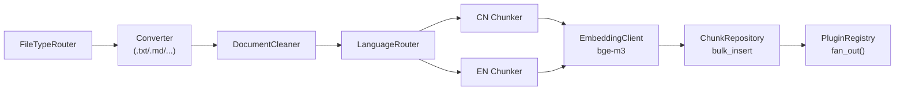

# 00_spec.md — Distributed RAG Agent

> Source: `docs/draft.md` · Standard: `docs/00_rule.md`

---

## 1. Mission

- Enterprise internal knowledge retrieval backend.
- Streaming chat answers grounded in private documents.
- Pluggable extractor architecture: graph reasoning (P3) without pipeline rewrite.

### ⚠️ P1 OPEN Mode
- Auth **DISABLED** in P1. `X-User-Id` header for tracing only. JWT restored in P2.
- **OpenFGA is out-of-scope across all phases.** ACL (if needed in P2) handled via owner-based filter.
- Startup guard refuses to start unless `RAGENT_AUTH_DISABLED=true AND RAGENT_ENV=dev`.

---

## 2. Phase 1 Scope

| In P1 | Deferred |
|---|---|
| Ingest CRUD (Create / Read / List / Delete) with cascade | JWT → P2 |
| Indexing Pipeline (§3.2) + Chat Pipeline (§3.4) | AsyncPipeline → P2 |
| Plugin Protocol v1, VectorExtractor, StubGraphExtractor | GraphExtractor → P3 |
| Third-party clients: Embedding, LLM, Rerank, TokenManager | Rerank wiring → P2 |
| Reconciler + locking | MCP real handler → P2 |
| Observability: OTEL auto-trace | — |

---

## 3. Domains

### 3.1 Ingest Lifecycle

**State machine:** `UPLOADED → PENDING → READY | FAILED`; `DELETING` transient on delete.

**Locking:** `SELECT … FOR UPDATE` (Worker); `FOR UPDATE SKIP LOCKED` (Reconciler). `update_status` raises `IllegalStateTransition` on invalid transition.

**Storage model:** MinIO is **transient staging only** — needed because Router (API) and Worker may run on different hosts. The original file is deleted from MinIO after the pipeline reaches a terminal state (`READY` or `FAILED`). After ingest, only chunks (ES) + metadata (MariaDB) remain.

**Supersede model (smart upsert):** Every `POST /ingest` carries a mandatory `(source_id, source_app)` pair (e.g. `("DOC-123", "confluence")`) and an optional `source_workspace`. The pair is the **logical identity** of a document — at steady state at most one `READY` row may exist per `(source_id, source_app)`. A new POST always creates a fresh `document_id`; when it reaches `READY`, the system enqueues a **supersede** task that selects every `READY` row sharing the same `(source_id, source_app)`, keeps the one with `MAX(created_at)`, and cascade-deletes the rest. This guarantees "latest write wins" even when documents finish out-of-order, gives zero-downtime replacement (old chunks remain queryable until the new ones are indexed), and preserves the old version if the new ingest fails. Supersede is enqueued **only** on the `PENDING → READY` transition; FAILED or mid-flight DELETE never triggers it. Uniqueness is **eventual**, enforced by supersede — not by a DB UNIQUE constraint, since transient duplicates are expected during ingestion. **Mutation = re-POST with the same `(source_id, source_app)`; there is no PUT/PATCH endpoint.**

**Create flow:**
1. `POST /ingest` (`source_id`, `source_app`, optional `source_workspace`) → MIME/size validation → MinIO upload (staging) → `documents(UPLOADED, source_id, source_app, source_workspace)` → kiq `ingest.pipeline` → 202
2. Worker: acquire(FOR UPDATE) → `PENDING`, attempt+1 → run pipeline → fan_out → **commit terminal status first** (`READY` or `FAILED`) → then best-effort `MinIOClient.delete_object` (errors swallowed and logged as `event=minio.orphan_object`); on `READY`, kiq `ingest.supersede(document_id)` (idempotent); any required plugin error → stay `PENDING` (Reconciler retries; MinIO kept); attempt > 5 → `FAILED` (then MinIO cleanup) + structured-log alert.
3. `ingest.supersede` worker: `SELECT … WHERE source_id=? AND source_app=? AND status='READY' FOR UPDATE SKIP LOCKED` → identify the row with `MAX(created_at)` as survivor → cascade-delete every other row in the set (same path as `DELETE /ingest/{id}`). Naturally idempotent: a re-delivered task finds at most one READY row remaining and no-ops.

**Delete flow:**
1. `DELETE /ingest/{id}` → acquire(FOR UPDATE) → `DELETING` → `fan_out_delete` → delete chunks → delete row → 204
2. (No MinIO step — object already cleared at terminal state. If status is still `PENDING`/`UPLOADED`, also delete MinIO object as part of cascade.)
3. Any mid-cascade failure → row stays `DELETING`; Reconciler resumes idempotently

**BDD:**
- **S1** POST 1 MB `.txt` → 202 + 26-char task_id; status → `READY` within 60 s; chunks in ES.
- **S10** Illegal transitions (e.g. `READY→PENDING`) raise `IllegalStateTransition`.
- **S12** DELETE cascade on `READY` doc → `DELETING` → all plugins called once → ES/row cleared → 204 (MinIO already cleared at READY).
- **S13** Any failure mid-delete → row stays `DELETING`; Reconciler resumes ≤ 5 min.
- **S16** Pipeline reaches terminal state (`READY` or `FAILED`) → MinIO object deleted; subsequent re-processing not possible without re-upload.
- **S14** Re-DELETE an already-deleted document → 204, no plugin calls.
- **S15** `GET /ingest?limit=2` on 5 docs → ≤ 2 items + `next_cursor` continues.
- **S17 supersede happy path** — Given a `READY` doc D1 with `(source_id="X", source_app="confluence")`, When client POSTs another file with the same pair, Then a new doc D2 is created; while D2 is `PENDING`, queries still see D1 chunks; when D2 reaches `READY`, supersede task cascade-deletes D1; queries now see only D2 chunks.
- **S18 supersede on failure preserves old** — Given D1 `READY` with `(source_id, source_app)=("X","confluence")`, When new D2 with the same pair ends up `FAILED`, Then D1 remains `READY` and queryable; supersede task is **not** enqueued.
- **S19 supersede idempotent** — Given supersede already ran for D2, When the task fires again, Then no further deletes occur (only one `READY` row remains for that `(source_id, source_app)`).
- **S20 supersede out-of-order finish** — Given D1 (created at t=0) and D2 (created at t=1) share `(source_id="X", source_app="confluence")`, When D2 reaches `READY` first (D1 still `PENDING`) and D1 reaches `READY` later, Then after both supersede tasks run only D2 (the row with `MAX(created_at)`) remains; D1 is cascade-deleted.
- **S22 same source_id different source_app coexist** — Given doc D1 with `(source_id="X", source_app="confluence")` is `READY`, When client POSTs with `(source_id="X", source_app="slack")`, Then both reach `READY` and coexist; supersede touches neither.
- **S23 missing source_id or source_app** — Given a POST omits either `source_id` or `source_app`, Then router returns 422 with field-level validation error; no MinIO upload, no DB row.
- **S21 worker crash post-commit MinIO orphan tolerated** — Given the worker has committed `status=READY` but crashed before `MinIO.delete_object` returned, When the document is fetched, Then status is `READY` and the orphan staging object is logged as `event=minio.orphan_object` (acceptable; P2 sweeper will GC).

---

### 3.2 Indexing Pipeline

```
FileTypeRouter → Converter → DocumentCleaner → LanguageRouter → Chunker → EmbeddingClient → ChunkRepository → PluginRegistry.fan_out()
```



**Haystack 2.x sync Pipeline in P1; AsyncPipeline in P2.**

Pluggable points: (a) per-format converter, (b) per-language splitter, (c) EmbeddingClient, (d) registered extractor plugins.

---

### 3.3 Pluggable Extractors

**Protocol v1 (frozen):**

```python
@runtime_checkable
class ExtractorPlugin(Protocol):
    name: str; required: bool; queue: str
    def extract(self, document_id: str) -> None: ...
    def delete(self, document_id: str) -> None: ...
    def health(self) -> bool: ...
```

**P1 plugins:** `VectorExtractor` (required, ES bulk), `StubGraphExtractor` (optional, no-op). See §4.4.

**Registry:**
- `register()` raises `DuplicatePluginError` on name conflict.
- `fan_out(document_id)` → dispatch extract to all plugins; `all_required_ok(results)` gates `READY`.
- `fan_out_delete(document_id)` → dispatch delete to all plugins.

**BDD:** S4 (missing field → isinstance fails), S5 (stub no-op → READY), S11 (duplicate name raises).

---

### 3.4 Chat Pipeline

```
QueryEmbedder → {ESVectorRetriever ∥ ESBM25Retriever} → DocumentJoiner(RRF) → LLMClient.stream → SSE
```

**P1 OPEN:** ACL filter is a no-op; `sources[]` unrestricted. P2: owner-based `terms(owner_user_id)` pre-filter on ES queries.

**Response:** SSE stream of `delta` events, closing with one `done { answer, sources[] }`.

**BDD:**
- **S6** — ≥ 1 `delta` + exactly one `done` with sources.
- **S8** — `POST /mcp/tools/rag` returns 501 in P1 (handler not yet wired).

---

### 3.5 Auth & Permission — DISABLED IN P1 → P2

- JWT layer OFF in P1. `X-User-Id: <string>` validated non-empty.
- **OpenFGA is out-of-scope across all phases.** No external authorization service.
- Audit logs for destructive ops emitted at INFO with `auth_mode=open` in P1.
- **TokenManager (J1→J2) is active in P1** — used by Embedding/LLM/Rerank clients only.

**P2 contract:**
- JWT verify → subject claim → `user_id`.
- ACL: owner-based filter at the ES layer (`terms(owner_user_id ∈ [user_id])`) — single SQL/ES predicate, no out-of-band service.
- Sharing model (group/role) deferred to a later phase if needed.

**BDD (P2-gated):** S9 (token refresh at `expiresAt − 5 min`).

---

### 3.6 Resilience

**Reconciler (cron 5 min, `SELECT … FOR UPDATE SKIP LOCKED`):**
- `PENDING > 5 min, attempt ≤ 5` → re-kiq `ingest.pipeline` (idempotent key: `document_id + attempt`)
- `PENDING > 5 min, attempt > 5` → `FAILED` + structured-log `event=ingest.failed`
- `DELETING > 5 min` → resume cascade delete idempotently

**BDD:**
- **S2** Given a `PENDING` document older than 5 min with `attempt ≤ 5`, When the reconciler runs, Then it re-kiqs `ingest.pipeline` exactly once per cycle (idempotent across redelivery).
- **S3** Given a `PENDING` document with `attempt > 5`, When the reconciler runs, Then status transitions to `FAILED` and a structured log line `event=ingest.failed` is emitted.

**Infrastructure:** Redis broker (TaskIQ) and Redis rate-limiter are **separate instances**.

---

### 3.7 Observability

- Haystack auto-trace + FastAPI OTEL middleware → Tempo + Prometheus.
- Structured logs for state-machine transitions; `auth_mode=open` field in P1.

---

## 4. Inventories

### 4.1 Endpoints

| Method | Path | P1 Auth | Request | Response |
|---|---|---|---|---|
| POST   | `/ingest`               | `X-User-Id` | `multipart/form-data: file` (≤ 50 MB, MIME ∈ §4.2), `source_id` (≤ 128, **mandatory**), `source_app` (≤ 64, **mandatory**), `source_workspace` (≤ 64, optional) | `202 { task_id }` — `task_id` **is** the `document_id` (26-char Crockford Base32). 422 if `source_id` or `source_app` missing/empty. |
| GET    | `/ingest/{id}`          | `X-User-Id` | — | `200 { status, attempt, updated_at }` |
| GET    | `/ingest?after=&limit=` | `X-User-Id` | — | `200 { items, next_cursor }` (limit ≤ 100) |
| DELETE | `/ingest/{id}`          | `X-User-Id` | — | `204` idempotent |
| POST   | `/chat`                 | `X-User-Id` | `{ query: str }` | `text/event-stream` (`delta`*, `done`) |
| POST   | `/mcp/tools/rag`        | `X-User-Id` | `{ query: str }` | **501** (P1) |

P2 auth: JWT verify + owner-based ACL filter on ES queries.

### 4.2 Supported Formats

| Format | Converter | Notes | Phase |
|---|---|---|:---:|
| `.txt`  | `TextFileToDocument`     | UTF-8 text | **P1** |
| `.md`   | `MarkdownToDocument`     | front-matter stripped | **P1** |
| `.html` | `HTMLToDocument`         | visible text, script/style stripped | **P1** |
| `.csv`  | `CSVToDocument`          | row-as-document | **P1** |
| `.pdf`  | `PyPDFToDocument`        | text-extractable only | P2 |
| `.docx` | `DOCXToDocument`         | body + tables | P2 |
| `.pptx` | `PPTXToDocument`         | slide text + notes | P2 |
| `.xlsx` | `XLSXToDocument`         | active sheets | P2 |

> 415 on unsupported MIME; 413 on > 50 MB. Image-only / scanned documents are not supported in any phase.

### 4.3 Pipeline Catalog

| Pipeline | Components | Test Path | Phase |
|---|---|---|:---:|
| **Ingest** | `FileTypeRouter → Converter → DocumentCleaner → LanguageRouter → {CN\|EN Chunker} → EmbeddingClient(bge-m3) → ChunkRepository → PluginRegistry.fan_out` | `tests/integration/test_ingest_pipeline.py` | **P1** sync |
| **Chat** | `QueryEmbedder → {ESVector ∥ ESBM25} → DocumentJoiner(RRF) → LLMClient.stream` | `tests/integration/test_chat_pipeline.py` | **P1** sync |

### 4.4 Plugin Catalog

| Plugin | `name` | `required` | `queue` | `extract()` | `delete()` | Phase |
|---|---|:---:|---|---|---|:---:|
| `VectorExtractor`    | `vector`     | ✓ | `extract.vector` | embed → ES bulk index by `chunk_id` | ES bulk `_op_type=delete` | **P1** |
| `StubGraphExtractor` | `graph_stub` | — | `extract.graph`  | no-op | no-op | **P1** |
| `GraphExtractor`     | `graph`      | — | `extract.graph`  | LightRAG → Graph DB upsert | entity GC + ref_count | P3 |

### 4.5 Third-Party Client Catalog

| Client | Endpoint | Auth | Phase |
|---|---|---|:---:|
| `TokenManager`    | `AI_API_AUTH_URL/auth/api/accesstoken`          | J1 → J2 | **P1** |
| `EmbeddingClient` | `EMBEDDING_API_URL/text_embedding`              | J2 | **P1** |
| `LLMClient`       | `LLM_API_URL/gpt_oss_120b/v1/chat/completions` | J2 | **P1** |
| `RerankClient`    | `REREANK_API_URL/`                              | J2 | P1 unit / P2 wired |
| `HRClient`        | `HR_API_URL/v3/employees`                       | `Authorization` | P2 |

All 3rd-party calls: timeout/retry/backoff per `00_rule.md`; circuit-breaker on client.

---

## 5. Data Structures

### 5.1 MariaDB

```sql
CREATE TABLE documents (
  document_id      CHAR(26)     PRIMARY KEY,
  owner_user_id    VARCHAR(64)  NOT NULL,
  source_id        VARCHAR(128) NOT NULL,
  source_app       VARCHAR(64)  NOT NULL,
  source_workspace VARCHAR(64)  NULL,
  storage_uri      VARCHAR(512) NOT NULL,
  status           ENUM('UPLOADED','PENDING','READY','FAILED','DELETING') NOT NULL,
  attempt          INT          NOT NULL DEFAULT 0,
  created_at       DATETIME(6)  NOT NULL,
  updated_at       DATETIME(6)  NOT NULL,
  INDEX idx_status_updated (status, updated_at),
  INDEX idx_source_app_id_status_created (source_app, source_id, status, created_at)
);
-- (source_id, source_app) is the LOGICAL identity. Uniqueness is eventual,
-- enforced by the supersede task — not a DB UNIQUE constraint, since
-- transient duplicates are expected during ingestion.

CREATE TABLE chunks (
  chunk_id    CHAR(26)   PRIMARY KEY,
  document_id CHAR(26)   NOT NULL,
  ord         INT        NOT NULL,
  text        MEDIUMTEXT NOT NULL,
  lang        VARCHAR(8) NOT NULL,
  INDEX idx_document (document_id)
);
```

No physical FK. ORM-level cascade only.

**ID classification:**
- **Internal IDs** (UID rule applies — `00_rule.md` §ID Generation Strategy): `document_id`, `chunk_id` — `CHAR(26)` UUIDv7→Crockford Base32, generated by `new_id()`.
- **External IDs** (UID rule does **not** apply — supplied by clients or upstream systems): `source_id` (client-supplied stable identifier, any string ≤ 128 chars: URL hash, external doc ID, etc.), `source_app` (≤ 64 chars; namespace/source system, e.g. `confluence`, `slack`, `intranet`), `source_workspace` (optional ≤ 64 chars; intra-app scope, e.g. team or space), `owner_user_id` (HR `employee_id`, any string ≤ 64 chars).
- The `task_id` returned from `POST /ingest` is the `document_id` itself; no separate task identifier exists.

### 5.2 Elasticsearch `chunks_v1`

```json
{
  "mappings": {
    "properties": {
      "chunk_id":    { "type": "keyword" },
      "document_id": { "type": "keyword" },
      "lang":        { "type": "keyword" },
      "text":        { "type": "text", "analyzer": "standard" },
      "embedding":   { "type": "dense_vector", "dims": 1024, "index": true, "similarity": "cosine" }
    }
  }
}
```

### 5.3 ID / DateTime

- `new_id()` → UUIDv7 → Crockford Base32 → 26 chars (lexicographically sortable).
- `utcnow()` → tz-aware UTC. `to_iso()` → ISO 8601 `...Z`. `from_db(naive)` → attach UTC.

---

## 6. Standards

- **Layers:** Router (HTTP only) → Service (orchestration) → Repository (CRUD only).
- **Methods:** ≤ 30 LOC, max 2-level nesting. Utilities in `utility/`.
- **IDs:** UUIDv7 + Crockford Base32 (26 chars). **DateTime:** end-to-end UTC + `Z` suffix.
- **DB:** no physical FK; index every `WHERE / JOIN / ORDER BY` field.
- **Quality gate:** `uv run ruff format . && uv run ruff check . --fix && uv run pytest` before every commit.
- **TDD commits:** `[STRUCTURAL]` or `[BEHAVIORAL]` prefix; never mixed.
