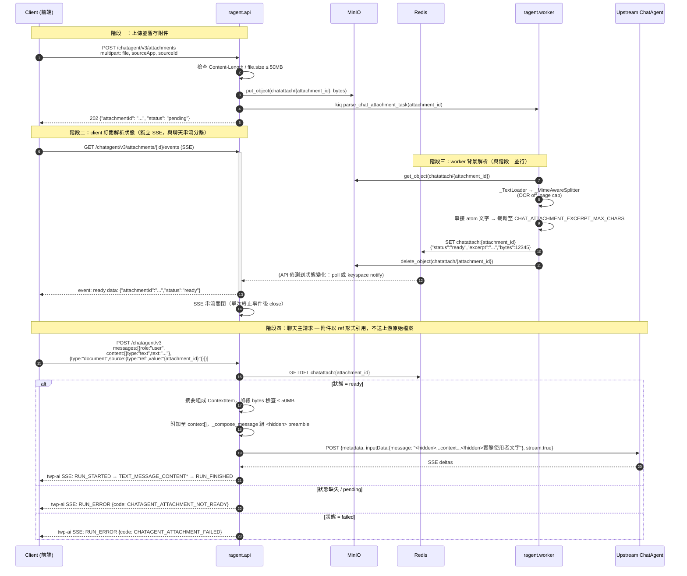

# ChatAgent v3 檔案附件流程（草案，待審閱）

## 1. 整體互動序列圖



## 2. 各階段 payload 範例

### 2.1 上傳附件 — `POST /chatagent/v3/attachments`

請求（multipart/form-data）：
```
file: <binary>
sourceApp: "webapp"
sourceId: "user-123"
```

回應 202：
```json
{ "attachmentId": "atc_8f2c1a", "status": "pending" }
```

### 2.2 訂閱解析狀態 — `GET /chatagent/v3/attachments/{id}/events`

SSE 事件（終止事件，單次後關閉）：
```
event: ready
data: {"attachmentId":"atc_8f2c1a","status":"ready"}
```
或
```
event: failed
data: {"attachmentId":"atc_8f2c1a","status":"failed","code":"CHATAGENT_ATTACHMENT_FAILED"}
```

### 2.3 Redis 暫存值 — `chatattach:{attachment_id}`

```json
{
  "status": "ready",
  "excerpt": "（截斷後的解析文字，≤ CHAT_ATTACHMENT_EXCERPT_MAX_CHARS）",
  "bytes": 1048576
}
```
worker 寫入後不設 TTL；該 key 在聊天主請求 `GETDEL` 時被取走並刪除（用完即丟，與 MinIO 物件刪除時機分離但語意一致）。

### 2.4 聊天主請求 — `POST /chatagent/v3`

```json
{
  "threadId": "thr_abc",
  "runId": "run_001",
  "messages": [
    {
      "role": "user",
      "content": [
        { "type": "text", "text": "幫我總結這份文件" },
        {
          "type": "document",
          "source": { "type": "ref", "value": "atc_8f2c1a", "mimeType": "application/pdf" }
        }
      ]
    }
  ],
  "tools": [],
  "state": null,
  "context": [],
  "forwardedProps": null
}
```

### 2.5 ragent → 上游 ChatAgent（附件已轉為純文字，原始檔案絕不外傳）

```json
{
  "metadata": { "apName": "...", "user": "user-123", "userToken": "...", "session": "thr_abc" },
  "inputData": {
    "message": "<hidden><context>[{\"description\":\"attachment\",\"value\":\"（解析摘要文字）\"}]</context></hidden>幫我總結這份文件"
  },
  "stream": true
}
```

## 3. 邊界與安全要點對照

| 要點 | 機制 |
|---|---|
| 檔案不外流上游 | 解析摘要走 `<hidden><context>` preamble，原始 bytes 從未進入 `inputData.message` |
| 50MB 單檔上限 | `POST /attachments` 提早以 `file.size`/Content-Length 拒絕 |
| 50MB 同輪加總上限 | T-CAFA.7 在 `GETDEL` 後依 Redis 記錄的 `bytes` 加總檢查 |
| 用完即丟 | MinIO 物件於 worker 解析完成/失敗後立即刪除；Redis key 於聊天主請求 `GETDEL` 時清除，無 TTL 依賴 |
| 不支援任意 URL 抓取 | `DocumentInputContent.source` 僅 `data`（小型 inline）/`ref`（伺服器端 attachment_id），無 `url` 變體，避免 SSRF |
| CPU 密集解析不卡 API event loop | 解析全部在 `ragent.worker`（TaskIQ task）執行，`ragent.api` 僅做 Redis O(1) 查詢 |
