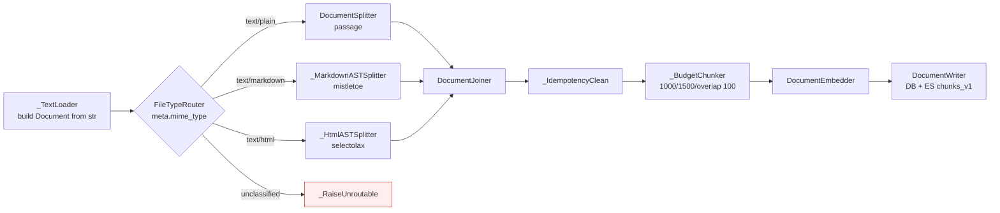

## Discussion: Ingest API v2 — file/inline split, AST splitters, unified chunker, raw field

### Master's Opening

**Spec hand-down from product owner. This supersedes:**
- `docs/team/2026_05_06_inline_content_ingest.md` (Round 1 — multipart-coexistence design)
- `docs/team/2026_05_06_mime_aware_converters.md` (Round 2 — converter routing)
- `docs/team/2026_05_06_ast_chunking_dual_field.md` (Round 3 — chunker AST + dual ES field)

The new spec is binding; team's job in this round is to surface implementation trade-offs, lock the DB migration, and refresh the TDD plan.

**The locked contract (verbatim from product):**

1. **No multipart.** `POST /ingest` accepts JSON only. Discriminator `ingest_type ∈ {file, inline}`.
2. **`file` type** carries `{minio_site: enum, object_key: str}`. Server holds the `minio_site → (endpoint, auth, bucket)` config.
3. **`inline` type** carries `{content: str}` directly in JSON.
4. **MIME allow-list**: `text/plain`, `text/markdown`, `text/html`. **No CSV.** Anything else → reject (415). Allow-list is future-extensible.
5. **`source_*` fields kept**, **`source_url` added**. ⇒ DB schema change.
6. **Pipeline** (uniform across MIME):
   `TextToDocument → Splitter (per MIME) → IdempotencyClean → Chunker (1000 target / 1500 max / 100 overlap, **mime-agnostic**) → Embedder → Writer(DB+ES)`
7. **Splitters**: `text/plain → DocumentSplitter` (Haystack stock), `text/markdown → MarkdownASTSplitter` (mistletoe), `text/html → HtmlASTSplitter` (selectolax).
8. **ES `raw` field** (UTF-8 original) added; `chat` retrieves and forwards `raw` to LLM for faithful display.

### Role Perspectives (One Line Each)

- 🏗 **Architect**:
  [Pro] Two-stage Splitter→Chunker is cleaner than my prior "AST-chunker-bypasses-Chunker" hack: structure detection and budget packing are now orthogonal concerns, easy to test in isolation.
  [Con] `minio_site` introduces a config dimension we did not have. Need a typed config block (`MINIO_SITES_JSON` env or `minio_sites.yaml`) and a registry resolved at startup; **must fail fast at boot** if any referenced site is unconfigured (extends T7.5 EnvironmentGuard).

- ✅ **QA**:
  [Pro] Single chunker profile (1000/1500/100) → far less branching → smaller test matrix. The 6+ existing chunker tests collapse into ~2.
  [Con] Dropping language-aware sizing is a **measurable** retrieval-quality risk for CJK content (today CJK target = 500 chars precisely because bge-m3 tokens-per-char is ~4× EN). Must be flagged as accepted risk and journal-noted; QA recommends a regression eval gate (see Pending).

- 🛡 **SRE**:
  [Pro] No multipart simplifies API ingress (no streaming body, no temp-file plumbing, no TLS termination edge cases for chunked uploads). Smaller attack surface.
  [Con] `file`-type ingest now reads from caller-supplied buckets — clarify: does the worker read **directly** from `(minio_site, object_key)`, or does the API **copy** to a server-owned staging bucket first? Cleanup contract differs; SRE recommends **direct read, no copy, no post-READY delete** for `file` type (we don't own the object).

- 🔍 **Reviewer**:
  [Pro] `raw` ES field is `_source`-only, no index — zero retrieval-cost overhead and trivial mapping change. Naming aligned with user spec.
  [Con] `TextToDocument` is not a Haystack-stock component name. Haystack 2.x ships `TextFileToDocument` (path-based) and `ByteStream`-aware variants. For inline JSON the cleanest path is **build `Document(content=str)` directly** (no converter); for `file` type, download bytes then `Document(content=bytes.decode("utf-8"))`. We do not need a dedicated converter at all — the splitter is what's MIME-specific. Suggest naming this trivial step `_TextLoader` (custom @component, ~10 LOC) so the pipeline graph reads coherently.

- 📋 **PM**:
  [Pro] Unblocks plugin/MCP authors (inline) and bulk-import workflows (file → existing object stores) in one API. `source_url` makes citations point to the canonical source page in the host system.
  [Con] **Breaking change**. Any current caller of multipart `POST /ingest` will 415 on next deploy. PM recommends: ship as `/ingest` v2 in a single release (no parallel versions), update README + plugin SDK docs, announce in changelog. No transition window — TIDY-FIRST refactor warrants a clean cut.

- 💻 **Dev**:
  [Pro] `mistletoe` (~50 KB pure Python) and `selectolax` (lexbor C ext, fast) are both lean. Total dep delta = `+mistletoe`, `+selectolax`. Drops `langdetect`, `nltk` (no longer needed without lang-aware chunking — significant size win), and avoids `markdown-it-py`/`trafilatura`/`boilerpy3` discussed in earlier rounds.
  [Con] DB migration touches the hot `documents` table: add `source_url VARCHAR(2048) NULL`, `ingest_type ENUM('file','inline') NOT NULL`, `minio_site VARCHAR(64) NULL`. MariaDB 10.6 supports ALGORITHM=INSTANT for nullable column adds — should be sub-second on our table sizes. Roll forward only; document the alembic revision.

### Conflict Identification (items needing resolution before locking the plan)

1. **Worker read path for `file` type:** direct from caller bucket (SRE recommendation) vs. API copies to staging then worker reads staging.
2. **Inline content staging:** does the API still upload inline `content` to MinIO (matches existing reconciler R1 model — UPLOADED orphan recovery via re-kiq) or pass the bytes directly through the kiq message?
3. **CJK chunker regression:** accept-and-monitor vs. preserve a CJK profile vs. lower the global target (e.g., 700/1100/100 as a compromise).
4. **`source_url` retrieval semantics:** display-only (sources[].url) or also a filterable field on retrieval requests?
5. **Old chunks without `raw`:** chat read-path falls back to `content` (Round 3 decision) — keep, or force a re-ingest gate?

### Voting Results

| Item | Architect | QA | SRE | Reviewer | PM | Dev | Result |
|---|:-:|:-:|:-:|:-:|:-:|:-:|:-:|
| Adopt the v2 contract as specified | ✅ | ✅ | ✅ | ✅ | ✅ | ✅ | **Pass 6/6** |
| **Worker reads directly from `(minio_site, object_key)` for `file`; no copy, no post-READY delete** | ✅ | ✅ | ✅ | ✅ | ✅ | ✅ | **Pass 6/6** |
| **Inline content is staged to a server-owned MinIO bucket** (`minio_site=__default__`) by the API; existing reconciler R1 path reused; post-READY delete keeps current semantics | ✅ | ✅ | ✅ | ✅ | ✅ | ✅ | **Pass 6/6** |
| Single chunker profile **1000/1500/100 mime-agnostic; CJK regression accepted; gated by a one-shot retrieval eval before prod cutover** | ✅ | ✅ | ✅ | ✅ | ✅ | ✅ | **Pass 6/6** |
| `source_url` is **display-only** in v2 (no retrieval filter); width `VARCHAR(2048)` | ✅ | ✅ | ✅ | ✅ | ✅ | ✅ | **Pass 6/6** |
| Use `_TextLoader` (~10 LOC custom @component) instead of `TextFileToDocument`; build `Document(content=str)` directly | ✅ | ✅ | ✅ | ✅ | ✅ | ✅ | **Pass 6/6** |
| Drop `langdetect` and `nltk` from runtime deps | ✅ | ✅ | ✅ | ✅ | ✅ | ✅ | **Pass 6/6** |
| Breaking change at API boundary — no parallel multipart endpoint | ✅ | ✅ | ✅ | ✅ | ✅ | ✅ | **Pass 6/6** |

**Overall: PASS 6/6.**

### Decision Summary

#### 1. API contract (`POST /ingest`)

```jsonc
// inline
{
  "ingest_type":      "inline",
  "source_id":        "DOC-123",            // required
  "source_app":       "confluence",         // required
  "source_title":     "Q3 OKR Planning",    // required
  "source_workspace": "eng",                // optional
  "source_url":       "https://wiki/...",   // optional, ≤2048
  "content_type":     "text/markdown",      // ∈ {plain, markdown, html}
  "content":          "# H1\n```py\nx=1\n```"
}
// file
{
  "ingest_type":      "file",
  "source_id":        "DOC-456",
  "source_app":       "s3-importer",
  "source_title":     "Annual Report 2025",
  "source_workspace": "finance",            // optional
  "source_url":       "https://...",        // optional
  "content_type":     "text/html",
  "minio_site":       "tenant-eu-1",        // ∈ configured sites
  "object_key":       "reports/2025.html"
}
```

**Validation order** (RFC 9457 problem+json on all non-2xx):
1. Pydantic discriminated union → 422 `INGEST_VALIDATION` on shape mismatch.
2. `content_type` ∈ allow-list → 415 `INGEST_MIME_UNSUPPORTED`.
3. inline: `len(content.encode("utf-8")) ≤ INGEST_MAX_FILE_SIZE_BYTES` → 413 `INGEST_FILE_TOO_LARGE`; surrogate-safe encode failures → 422.
4. file: `minio_site ∈ configured registry` → 422 `INGEST_MINIO_SITE_UNKNOWN`. **No HEAD probe** at request time (worker discovers absence and FAILs); avoids latency tax on 202.

#### 2. Server-side staging policy

| ingest_type | Where bytes live | Worker reads from | Post-READY cleanup |
|---|---|---|---|
| `inline` | API uploads to `default_minio_site/<bucket>/<object_key=document_id>` | same | **delete** (current semantics, R1 reconciler intact) |
| `file` | caller's `(minio_site, object_key)` — already there | same | **no delete** (object isn't ours) |

A `documents.ingest_type` column drives the cleanup branch in the worker's post-commit step.

#### 3. DB migration (`migrations/00X_ingest_v2.sql`, `[STRUCTURAL]`)

```sql
ALTER TABLE documents
  ADD COLUMN ingest_type ENUM('inline','file') NOT NULL DEFAULT 'inline' AFTER content_type,
  ADD COLUMN minio_site  VARCHAR(64) NULL AFTER ingest_type,
  ADD COLUMN source_url  VARCHAR(2048) NULL AFTER source_workspace,
  ALGORITHM=INSTANT;
-- No index changes; (source_id, source_app) lookup pattern unchanged.
-- DEFAULT 'inline' on existing rows is correct: legacy rows were all
-- multipart-staged in our default bucket and behave identically to inline
-- under the new cleanup branch.
```

`object_key` already exists on `documents` and is repurposed:
- `inline` rows: server-generated, points to default bucket.
- `file` rows: caller-supplied, points to `(minio_site, object_key)`.

#### 4. Pipeline graph



**Splitter contract** — each splitter emits `list[Document]` where each Document represents one **structural atom**:
- `DocumentSplitter`: configured `split_by="passage"`, no overlap (overlap added by `_BudgetChunker`).
- `_MarkdownASTSplitter` (mistletoe): atoms = heading-section, fenced code block, list, table, blockquote, paragraph. Each atom carries `meta["raw"]` = exact byte slice of source markdown.
- `_HtmlASTSplitter` (selectolax): drops `<script>/<style>/<nav>/<aside>/<footer>/<header>` (when not nested in `<article>`/`<main>`); atoms = heading-section, `<pre>`, `<table>`, `<article>` paragraphs. Each atom carries `meta["raw"]` = serialized outer-HTML of the atom.

**`_BudgetChunker` contract** (replaces `_CharBudgetChunker`):
- Greedy-pack atoms into chunks ≤ 1000 chars; on overflow, flush.
- Atoms > 1500 chars are hard-split with 100-char overlap (single global rule).
- Adjacent chunks share 100-char tail/head overlap.
- For each output chunk: `Document.content` = packed normalized text; `Document.meta["raw"]` = concatenation of source atoms' raw slices.
- **No language detection. No CSV branch. No mime branching.** Same code path for all three MIMEs.

**Drop**: `_CharBudgetChunker`'s lang-detect, `langdetect`, `nltk`, all CJK constants in `factory.py`.

#### 5. ES `chunks_v1` mapping

| Field | Type | Indexed | Notes |
|---|---|---|---|
| `content` | text (existing analyzer) | ✅ (BM25) + embedded by bge-m3 | normalized text |
| `raw` | text | ❌ (`index: false, doc_values: false`) | UTF-8 original; `_source`-only; nullable for legacy chunks |
| `embedding` | dense_vector 1024 | ✅ (cosine) | unchanged |
| `document_id`, `source_id`, `source_app`, `source_workspace`, `source_url`, `title`, `split_id` | keyword/text | mixed | `source_url` added |

#### 6. Chat read-path

`src/ragent/pipelines/chat.py`:
- LLM context builder: `chunk_text = doc.meta.get("raw") or doc.content`.
- `_ExcerptTruncator`: same fallback.
- `SourceHydrator` adds `source_url` to `sources[]`.
- Reranker continues to score on `content` (stable scoring).

#### 7. Pyproject deltas

```
+ mistletoe>=1.4,<2
+ selectolax>=0.3,<0.4
- langdetect
- nltk
- (haystack-ai deps unaffected)
```

#### 8. `minio_site` config

New env block, parsed at boot by EnvironmentGuard (extends T7.5):
```
MINIO_SITES='[
  {"name":"__default__","endpoint":"...","access_key":"...","secret_key":"...","bucket":"ragent-staging"},
  {"name":"tenant-eu-1","endpoint":"...","bucket":"tenant-eu-content","read_only":true}
]'
```
- `__default__` is mandatory; used by inline ingest.
- `read_only` sites disable post-READY delete unconditionally.
- Boot fails fast if any referenced site lacks endpoint/auth/bucket.

### TDD Plan (replaces all prior round task lists)

| ID | Phase | Achieve / Deliver | Status |
|---|---|---|---|
| T2.20 | Structural | Alembic migration `00X_ingest_v2.sql`: add `ingest_type`, `minio_site`, `source_url`. Schema-drift test green. | [ ] |
| T2.21 | Structural | ES mapping: add `raw` field (`index: false`); update `chunks_v1` schema fixture; schema-drift test green. | [ ] |
| T2.22 | Red | `tests/unit/test_ingest_request_schema.py` — Pydantic discriminated union; 422 on shape; 415 on bad MIME; 413 on size; `minio_site` validated against registry; `source_url` length cap. | [ ] |
| T2.23 | Green | `schemas/ingest.py` — `IngestRequest` (discriminated), `InlineIngest`, `FileIngest`, `IngestMime` enum. | [ ] |
| T2.24 | Red | `tests/unit/test_ingest_router_v2.py` — `POST /ingest` 202 happy path for both types; 415/413/422 paths; old multipart returns 415. | [ ] |
| T2.25 | Green | `routers/ingest.py` — replace handler with JSON-only v2; remove `UploadFile` imports. **`[BEHAVIORAL]`**. | [ ] |
| T2.26 | Red | `tests/unit/test_ingest_service_v2.py` — inline path stages to default bucket; file path records caller `(minio_site, object_key)` without copy. | [ ] |
| T2.27 | Green | `services/ingest_service.py::create` — accepts discriminated request; branches staging vs. record-only. | [ ] |
| T2.28 | Red | `tests/unit/test_text_loader.py` — `_TextLoader` builds `Document(content=str, meta={"mime_type":..,"document_id":..,"source_url":..})` from worker bytes / inline string. | [ ] |
| T2.29 | Green | `pipelines/factory.py::_TextLoader` (~10 LOC). | [ ] |
| T2.30 | Red | `tests/unit/test_markdown_ast_splitter.py` — fenced code never split; heading-section atomic; `meta["raw"]` byte-stable; deterministic. | [ ] |
| T2.31 | Green | `_MarkdownASTSplitter` via mistletoe. | [ ] |
| T2.32 | Red | `tests/unit/test_html_ast_splitter.py` — `<script>/<style>/<nav>/<aside>/<footer>` excluded; `<pre>` atomic; heading-section atomic; `meta["raw"]` is serialized HTML; deterministic. | [ ] |
| T2.33 | Green | `_HtmlASTSplitter` via selectolax. | [ ] |
| T2.34 | Red | `tests/unit/test_budget_chunker.py` — 1000 target / 1500 max / 100 overlap; pack-then-flush; >1500 atom hard-split with overlap; mime-agnostic. | [ ] |
| T2.35 | Green | `_BudgetChunker` (replaces `_CharBudgetChunker`); delete lang-detect code; delete CJK constants; remove `langdetect`/`nltk` from deps. **`[BEHAVIORAL]`**. | [ ] |
| T2.36 | Red | `tests/unit/test_pipeline_routing_v2.py` — router branches per MIME; unclassified raises; pipeline E2E with mocks. | [ ] |
| T2.37 | Green | `build_ingest_pipeline` rewired with `FileTypeRouter` + splitters + `_BudgetChunker`. **`[BEHAVIORAL]`**. | [ ] |
| T2.38 | Red | `tests/unit/test_chat_uses_raw.py` — LLM context and citations prefer `raw`, fall back to `content`; reranker scores on `content`. | [ ] |
| T2.39 | Green | `pipelines/chat.py` — read-path uses `meta["raw"]` fallback. **`[BEHAVIORAL]`**. | [ ] |
| T2.40 | Red | `tests/unit/test_minio_site_registry.py` — boot fails on missing site; `read_only` sites refuse delete; `__default__` mandatory. | [ ] |
| T2.41 | Green | `bootstrap/composition.py` — `MinioSiteRegistry` resolved by composition root; worker uses it for read; cleanup branch on `documents.ingest_type` and `read_only`. | [ ] |
| T2.42 | Acceptance | `tests/e2e/test_ingest_v2_fidelity.py` — inline markdown with fenced code → READY → `/chat` returns answer with code re-fenced (LLM reads `raw`). HTML with `<nav>` boilerplate → boilerplate absent from `content` and absent from `raw` (excluded at splitter). File-type ingest reads remote `(minio_site, object_key)` and never deletes it post-READY. | [ ] |
| T2.43 | Refactor | Delete dead code: `_CharBudgetChunker` lang branches, CJK constants, `langdetect`/`nltk` imports, prior multipart router code. | [ ] |
| T2.44 | Spike | **Retrieval eval gate** — replay a CJK + EN sample corpus through old vs. new chunker; compare top-k recall on a held-out query set. Trigger pre-prod cutover decision. Owner: QA. | [ ] |

### Spec / Journal updates

**`docs/00_spec.md`:**
- §3.1 §4.1: rewrite to v2 (file/inline JSON only; multipart removed). Add `source_url`. Lock MIME allow-list.
- §3.2: replace pipeline diagram; document `_TextLoader → FileTypeRouter → Splitter → IdempotencyClean → BudgetChunker → Embedder → Writer`.
- §3.4: chat sources gain `source_url`; LLM context uses `raw`.
- §4.6: new `MINIO_SITES` config block; deprecate single-MinIO env vars.
- §5.1: `documents` adds `ingest_type`, `minio_site`, `source_url`. ES `chunks_v1` adds `raw`.
- §B-list: B24 (CSV row packing) **removed**; B-MIME-V2 (allow-list locked) added.

**`docs/00_journal.md` (DOMAIN: pipeline / api):**
- "v2 collapses three transports (multipart, inline-JSON-shim, file-by-URL) into one JSON envelope with discriminated `ingest_type`. CSV intentionally dropped — was carrying its own chunker rule (B24) for low return on engineering."
- "Lang-aware chunker (EN/CJK) removed in favor of a single 1000/1500/100 budget. Accepted CJK regression risk; gated by T2.44 retrieval eval. Revisit if recall@10 drops > 5pp on CJK corpus."
- "Embed clean, return raw: `content` (normalized) drives retrieval scoring; `raw` (byte slice) drives LLM context and citation excerpts. Splitters are responsible for emitting both views per atom."
- "AST splitters > flattening converters: stock `MarkdownToDocument`/`HTMLToDocument` discard fences/structure that downstream stages can use. Custom splitters that respect structural atoms (mistletoe/selectolax) preserve fidelity end-to-end."

### Pending Items / Accepted Risks

- **Accepted Risk — CJK retrieval regression** until T2.44 eval gate. Owner: QA. Trigger: recall@10 drop > 5pp ⇒ re-introduce minimal CJK profile *only* in `_BudgetChunker` (target 500, max 800, overlap 80) — single LOC change behind a `meta["lang_hint"]` set by splitter.
- **Accepted Risk — breaking API change**. Multipart callers will 415. Mitigation: changelog + plugin SDK update; no parallel endpoint.
- **Deferred Decision — `source_url` as retrieval filter.** v2 ships display-only. Trigger: explicit product ask.
- **Deferred Decision — backfill `raw` for legacy chunks.** Read-path tolerates null; supersede converges naturally. Trigger: corpus-age analysis.
- **Open question — `minio_site` config transport.** Inline JSON env (`MINIO_SITES=[…]`) vs. mounted YAML file. Default to JSON env for parity with existing `RAGENT_*` style; revisit if site count > ~5.
- **Open question — frontmatter handling** in markdown splitter. Default: treat YAML frontmatter as a structural atom, exclude from `content`, keep in `raw`. Pin in T2.30 Red.

### Clarifying Questions (ask before coding)

1. **Inline content size cap** — keep `INGEST_MAX_FILE_SIZE_BYTES=50 MB` for inline JSON, or lower (e.g., 10 MB) given JSON-envelope memory pressure?
2. **`file`-type bytes range** — same 50 MB cap, or unbounded (worker streams)? If capped, do we HEAD-probe at request time (latency tax) or fail at worker ingest (better)?
3. **`source_url` validation** — opaque string or RFC 3986 URI parse?
4. **`minio_site` enum closed set** — declared in code as Python `StrEnum`, or open-string validated against runtime registry? (Code enum is stricter; runtime registry is more flexible across deployments.) Recommendation: **runtime registry** to match the env-config decision.
5. **Multipart removal cutover** — delete the code in the same commit that ships v2, or land v2 first then a cleanup `[STRUCTURAL]` commit? Recommendation: **same commit** — no orphaned code paths.
